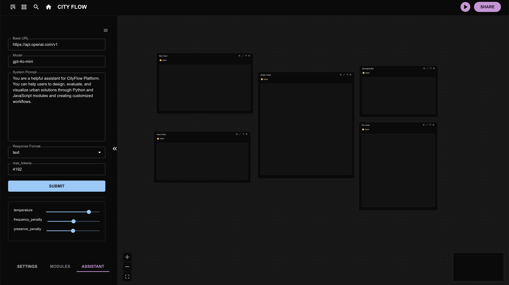
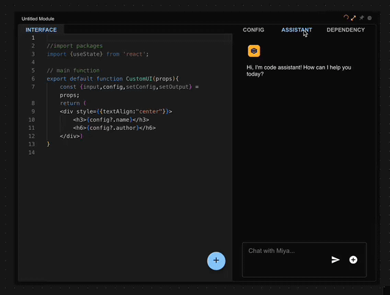
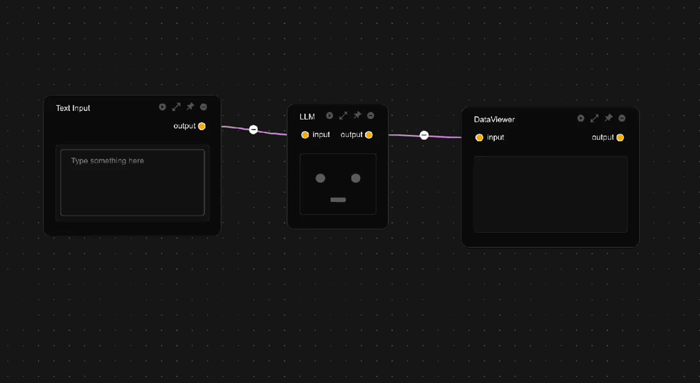

# LLM Configuration / 大语言模型配置

CityFlow provides three types of large language model assistants: the Global Assistant, the Module Assistant, and the Data Assistant, each serving different scenarios. The Global Assistant handles general tasks such as general Q&A, workflow retrieval (WIP), tool usage (WIP), etc. The Module Assistant aids in writing code for computational modules, with each module's assistant parameters set independently, allowing for tailored behavior as needed. The Data Assistant uses large language models for data processing, enabling natural language transformation of the Data Assistant into various processors.

CityFlow 提供三种大语言模型助手，全局助手、模块助手和数据助手，分别服务于不同场景。全局助手负责通用任务的处理，如通用问答、工作流检索（WIP）、工具使用（WIP）等等；模块助手辅助计算模块代码的编写，每一个模块的助手参数设置都互相独立，因此可以根据需要配置模块的不同行为；数据助手以大语言模型进行数据处理，可以用自然语言将数据助手化身不同的处理器。

All assistants share the same API key but support independent configuration of model parameters for fine-grained control.

所有助手共享同一API密钥，但支持独立配置模型参数，实现精细化控制。

## 1. API Key Configuration / API密钥配置

### Get API Key

Services supporting the Openai API format can be used on the CityFlow platform. Here, we take the acquisition of the DeepSeek API as an example:

支持Openai API格式的服务都可以在CityFlow平台使用，此处以DeepSeek API的获取为例:

- Visit the [DeepSeek official website](https://platform.deepseek.com/)

- Log in and create an API key

- Copy the generated key

- Paste the copied key in the Advanced Settings dropdown menu under INIT ENVIRONMENT on the Cityflow workflow interface. Note: All keys are only saved in the browser's local localStorage.

- Click the ASSISTANT tab at the bottom of the main interface, then click the menu button in the upper right corner of the chat interface to enter the large language model assistant settings interface, and configure the base_url and model. For DeepSeek, fill in x for base_url and deepseek-chat for model. For other models, modify to the corresponding link and model name. The base_url and model set in the global assistant settings will be shared with other assistants to avoid repeated settings, but other assistants support individual modifications.

### 获取API密钥

- 访问 [DeepSeek官网](https://platform.deepseek.com/)
- 登录后创建API密钥
- 复制生成的密钥
- 在Cityflow工作流界面，`INIT ENVIRONMENT` 下方的 `Advanced Settings` 下拉菜单中粘贴复制的密钥。注意：所有的密钥都只会保存在浏览器本地的 `localStorage`中。
- 点击主界面下方的`ASSISTANT`标签，然后点击聊天界面右上方的菜单按钮，进入大语言模型助手设置界面，配置好`base_url` 和 `model`。以DeepSeek为例，这里`base_url`填入`x`, `model`填入`deepseek-chat`。 如其他模型则修改为对应链接和模型名称。在全局助手设置的`base_url`和`model`会与其他助手共享，以避免重复设置，但是支持其他助手单独修改。

After completing the setup, you can use the large language model assistant to assist in completing tasks.

设置完成之后，即可使用大语言模型助手辅助完成工作。

## 2. 详细参数设置 / Detailed Parameters

In the upper right corner of the chat interface, there is a menu button. Clicking it will switch to the large language model parameter settings interface.

在聊天界面右上角，有一个菜单按钮，点击之后会切换到，大语言模型参数设置界面

### Core Parameters

- system_prompt: Defines the assistant's identity and behavior with system-level prompts

- response_format: Return format (text/json_object, recommended for Data Assistant to use json). If the return format is json_object, the word json must appear in the system prompt.

- temperature: The higher the value, the more random the output (recommended 0.3-0.8)

- frequency_penalty: Suppresses repeated words (positive values penalize/negative values encourage)

- presence_penalty: Controls topic novelty (positive values explore new topics)

### 核心参数说明

- system_prompt: 定义助手身份和行为的系统级提示词
- response_format: 返回格式(text/json_object,推荐数据助手使用json),返回格式为`json_object`则在系统提示词中必须出现`json`字样。
- temperature: 值越高输出越随机（建议0.3-0.8）
- frequency_penalty: 抑制重复用词（正值惩罚/负值鼓励）
- presence_penalty: 控制话题新颖度（正值探索新主题）

## 3. Assistant Types/ 助手类型详解

### Global Assistant/ 全局助手

- General Q&A consultation / 通用问答咨询

- Workflow retrieval (WIP) / 工作流程检索（开发中）

- Tool use (WIP) / 工具调用（开发中）

### Module Assistant/ 模块助手

- Computational modules can be configured independently / 计算模块可独立配置
- Automatically obtains module context information / 自动获取模块上下文信息
- Supports generating module code that meets the requirements of the cityflow platform / 支持生成符合cityflow platform平台要求的模块代码
- **⚠️ Note: If unsure, it is not recommended to modify the system prompts of the module assistant / 注意： 若无把握，不建议修改模块助手的系统提示词**

### 数据助手

- Clearly define data structure in system prompts / 在系统提示中明确数据结构
- It is recommended to use json_object as the output structure for subsequent processing / 建议使用`json_object`作为输出结构以便后续处理

