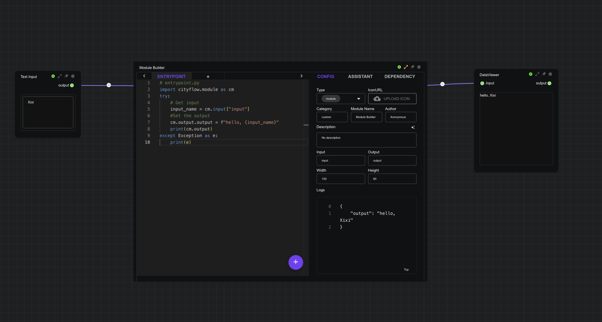
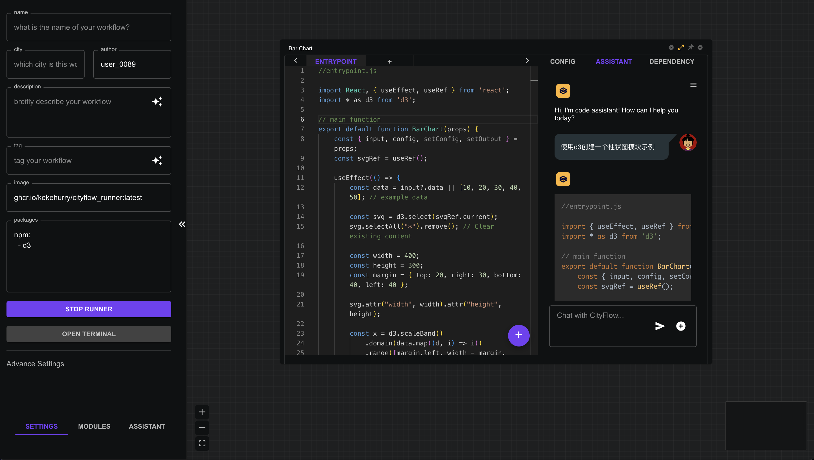
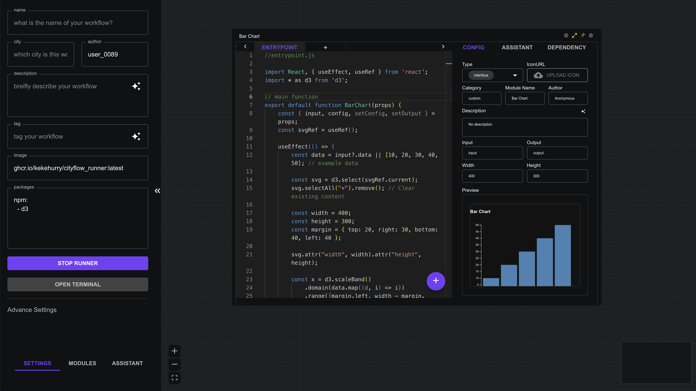

# Quick Start

## Drag & Connect

The basic operations of the CityFlow platform mainly rely on mouse dragging and connecting:

- Add a module: Drag a module from the left module list to the main interface using the left mouse button.
- Connect two modules: Hold the left mouse button from the output of a module and drag the connection line to the input of the next module.
- Move a module: Hold the left mouse button on the module's title bar and drag.
- Delete a module: Click the `remove` icon in the upper right corner of the module.
- Copy a module: Right-click on the module and select `COPY`.
- Paste a module: Right-click on the module and select `PASTE`. Supports copying and pasting modules from another browser page.
- Save a module: Right-click on the module and select `SAVE`, or click the '+' button in the code editor interface and choose to save.


## Create a Custom Module

- Drag a new `Module Builder` module from the left module list to the main interface. Connect the module's input to a `Text Input` module and the output to a `Data Viewer` module.
- Click the `expand` button in the upper right corner to open the module settings interface.
- Click the module type dropdown menu and select the `module` type.
- In the code editor, enter the following Python code:

    ```python
    # entrypoint.py
    import cityflow.module as cm
    try:
        # Get input
        input_name = cm.input["input"]
        #Set the output
        cm.output = f"hello, {input_name}"
        print(cm.output)
    except Exception as e:
        print(e)
    ```
- Click the run button on each module, enter a name in the input, and view the output information.



## Create a Module Using AI

⚠️Note: To use the AI function, refer to the [AI Assistant](/workflow/assistant) page for instructions on setting up the API KEY.

- In the `packages` section of the left initialization panel, enter the following information to install `d3`, then click `Init Environment` and wait for the installation to complete.

```yaml
npm:
  - d3
```
- Drag a new `Module Builder` module from the left module list to the main interface, and click the `expand` button located at the top right corner to open the module settings interface.

- Change the module name to `Bar Chart`, and set the module width to 400 and height to 300.

- Click the `Assistant` tab at the top right of the settings interface to open the module assistant.

- In the module assistant chat box, enter the request: "Create a bar chart module example using d3."



- After the code is generated, click the `Send` button below the code block to send the generated code to the editor.
- Switch back to the `Config` tab, click the '+' button to submit the code, and wait for the compilation to complete and preview the rendered result.
- Click the `expand` button to close the editing interface and view the new module.



## 保存和分享

Several methods for saving and sharing workflows in the CityFlow platform:

- `Ctrl`+`S`: Save the current workflow to the database, which can later be viewed in the user interface (click the `Home` icon).
- `Save` button: Click the `CityFlow Logo` icon at the top, select `Save`, and save the current workflow to the database, which can later be viewed in the user interface (click the `Home` icon).
- `Download` button: Click the `CityFlow Logo` icon at the top, select `Download`, and download all information of the current workflow into a JSON file. This file can be shared with others and later reopened via `Upload`.
- `Share` button: Click `Share` at the top right to share the current workflow to the community, which can later be viewed in the community interface (click the `Community` icon).

## Using Community Workflows

- Click the `Community` icon in the top toolbar to enter the community interface.
- Select a workflow to open, and click the `Run` button at the top right of the toolbar to run the community workflow.


> **Tips:**
> When sharing a workflow, you can add parameters to the workflow URL to achieve different sharing effects:
> - `demo=true`: Directly opens the workflow display interface. For example: `https://cityflow.media.mit.edu/flow?id=aba3472421b9bea8f0347ee350dd7b34&demo=true`
> - `embed=true`: Embeds the workflow into another webpage. For example: `https://cityflow.media.mit.edu/flow?id=aba3472421b9bea8f0347ee350dd7b34&embed=true`. 

The window below shows the result of embedding a workflow👇:


<iframe style={{width:"100%", height:"400px"}} src="https://cityflow.media.mit.edu/flow?id=aba3472421b9bea8f0347ee350dd7b34&embed=true" />

