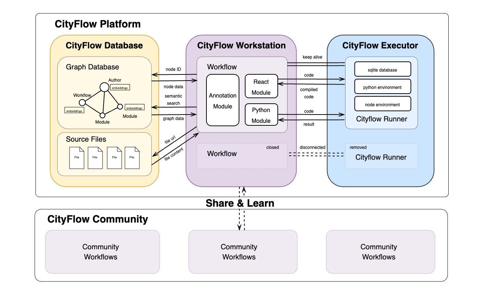

# System Architecture

The system architecture of the CityFlow platform consists of three core components: **CityFlow Database**, **CityFlow Workstation**, and **CityFlow Executor**. The CityFlow Database is a graph-based database that stores workflow information as nodes and edges, while CityFlow Workstation serves as the main user interface, providing an intuitive, modular programming environment. CityFlow Executor is responsible for managing the execution containers of workflows.

## CityFlow Workstation

CityFlow Workstation is a node-based visual programming environment similar to `Grasshopper` and `ComfyUI`. Its main user interface is built on `react-flow`. The basic modules included in CityFlow Workstation can be categorized based on the type of code they execute:

- **Annotation Module**: This module does not participate in the logic of the workflow but serves as an auxiliary tool for explanation and annotation.

- **React Module**: Users can write and execute React code here. Once the code is submitted, it is compiled by **CityFlow Executor** into browser-ready frontend code and can run independently.

- **Python Module**: This module allows users to write Python code. The code is submitted to **CityFlow Executor** for execution, and the results are returned. Each execution requires a connection to CityFlow Executor.

## CityFlow Database

CityFlow Database uses Neo4J, a graph database, to store workflow information. The main types of nodes and edges in the database are as follows:

**Nodes**:
- **Author**: Information about the module or workflow author.
- **Workflow**: Main information about the workflow, including the name, author, description, type, node IDs, and connecting edges.
- **Module**: Main information about the module, including the name, author, description, and code.

Additionally, all nodes in the database are embedded using the all-MiniLM-L6-v2 model to convert them into vector representations, enabling semantic-based workflow search.

**Edges**:
- **created_by**: Connects a `Module` and its `Author`, or a `Workflow` and its `Author`.
- **part_of**: Connects a `Module` and a `Workflow`.
- **connected_to**: Connects one `Module` to another.
- **forked_from**: Connects a `Workflow` to another`Workflow` if it is derived from it, the system automatically adds reference information using 'forked_from'.

The graph-based database is highly compatible with the node-based UI in CityFlow Workstation. With the integration of large language models and GraphRAG technology, workflows can be searched more accurately based on semantic needs.

## CityFlow Executor

To ensure flexibility and security during code execution, CityFlow Executor uses Docker containers to run workflows. Different modules within a workflow share a single **CityFlow Runner** container environment. Users can configure the environment for each workflow using YAML format, and each CityFlow Runner container includes a temporary database for module data sharing. The lifecycle of CityFlow Runner containers is managed by CityFlow Executor. If the user disconnects from the UI for a specified period, the corresponding container will be automatically destroyed. The containerized execution approach also allows for future expansion to support headless (non-GUI) workflow execution.

## CityFlow Community

The CityFlow community is built around the concept of open collaboration and is committed to achieving the core goal of the CityFlow platform - **to create smarter, more sustainable cities**. By sharing research results, workflows, and case studies, community members contribute to a growing library of urban design solutions. By facilitating the exchange of knowledge and best practices, CityFlow makes it easier to learn and apply successful planning practices for more effective urban planning and management to help drive sustainable development and innovation in urban planning methods.