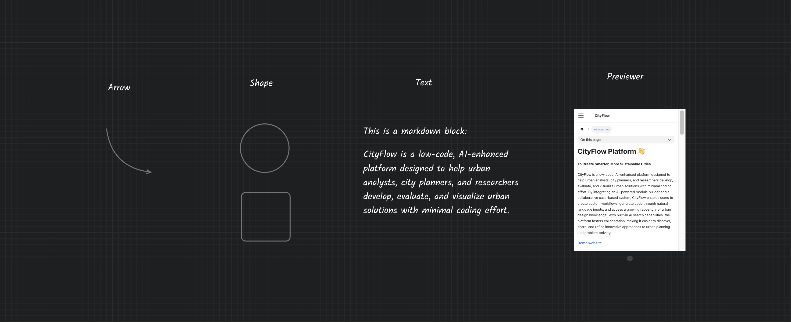

# Annotation Module

The annotation module does not participate in the computational logic of the workflow and is used solely for annotating elements. The annotation module has a hidden toolbar that automatically appears when the mouse hovers over it. The toolbar contains three buttons: `Rotate`, `Scale`, and `Delete`. Additionally, the annotation module supports double-clicking to enter edit mode. The CityFlow platform provides four basic annotation modules:

- **Arrow**: A simple Bezier curve arrow that can be adjusted by double-clicking to open control points and modify the arrow's curve.

- **Shape**: A simple shape tool that can be toggled between a circle and a square by double-clicking.

- **Text**: Double-click to enter text editing mode, supporting markdown format rendering and formula display. Use `Shift` + `Enter` to submit text changes and exit edit mode.

- **Previewer**: An iframe URL preview component that can embed other web pages, videos, or images.

