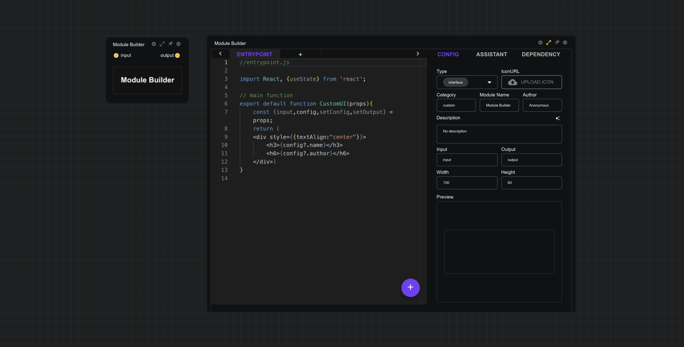

# Module Builder

The Module Builder is the core component of the CityFlow Platform, and all user-defined modules are built based on it. The node container of the Module Builder is an extended node with two forms: the UI interface and the editing interface. These two forms can be switched by clicking the `expand` icon.

The UI interface is an iframe container that runs the front-end code compiled by **CityFlow Runner** in an isolated environment. The interface elements within the iframe container can be fully customized by the user through the editor.

The editing interface consists of two parts: a code editor on the left, which supports multi-file editing, and a settings interface on the right. The settings interface has three tabs:

- **CONFIG**
    - **Type**: The module type can be either `interface` or `module`. When switched to `interface` type, the code editor will switch to `react` code mode, while `module` will be in python code mode.
    - **IconURL**: Supports uploading module icons.
    - **Category**: Customize the category to which the module belongs, such as `GIS`, `ABM`, etc.
    - **Module Name**: Setting the module name will help the module assistant better understand the main functions of the module and improve the accuracy of code writing.
    - **Author**: The name of the module creator.
    - **Description**: A brief description of the module's functions. Setting a functional description helps the module assistant understand the module's main functions and also supports the module assistant in generating a functional description based on the code content with one click.
    - **Input**: The names of the input variables required by the module, separated by commas. For example, `input1,input2`. The Module Builder will automatically generate corresponding connection points based on the input variable names to receive inputs from other modules.
    - **Output**: The names of the output variables required by the module, separated by commas. For example, `output1,output2`. The Module Builder will automatically generate corresponding connection points based on the output variable names to output the corresponding data.
    - **Width**: The width of the module's UI interface.
    - **Height**: The height of the module's UI interface.
    - **Preview（when type=`interface`）**: When the module type is `interface`, the settings interface will display a UI preview window for easy code debugging.
    - **Logs （when type=`module`**: When the module type is `module`, the settings interface will display a python code log information window for easy code debugging.

- **ASSSISTANT**: The module assistant can access the module's basic information and current code information to help users complete the module code writing. The module assistant can change the settings of the large language model through the settings in the upper right corner. Except for sharing the same API KEY, the settings of each module's assistant are independent and do not affect each other.

- **DEPENDENCY**: Additional dependency files can be uploaded.

For more information on writing `react` and `python` code in the Module Builder, please refer to the following pages:

- [Python Module](/module/builder/python)
- [React Module](/module/builder/react)