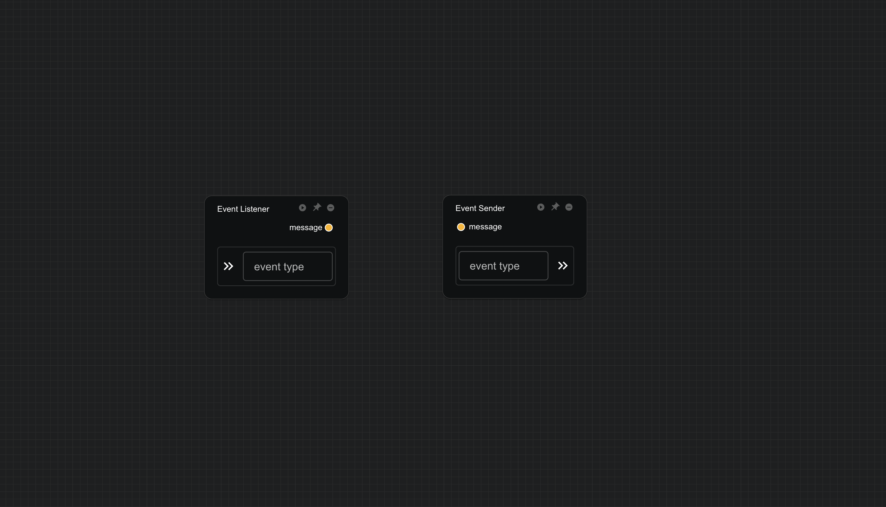

# Event Listener/Sender

In some complex scenarios, the update of a workflow's preceding components may depend on the output of subsequent components. For example, in a loop simulation, the initial state of the next simulation step depends on the output of the previous simulation. To prevent the workflow from deadlocking, the workflow itself does not directly support loop results. Instead, it relies on **Event Listener** and **Event Sender** components to achieve this functionality.

- **Event Listener**: This component utilizes the browser's event listening mechanism to listen for specified event types. When the monitored event is triggered and updated, the event listener transmits the received message to its output port for use by subsequent components.

- **Event Sender**: This component is also based on the browser's event mechanism and is used to send specified event types. It has an input port, and when the input data is updated, the event sender sends the input data through the specified event type, thereby triggering the relevant event listeners.

By leveraging the browser's event mechanism, the **Event Listener** and **Event Sender** components enable asynchronous data transfer and handling of circular dependencies in workflows, avoiding workflow deadlocks.

