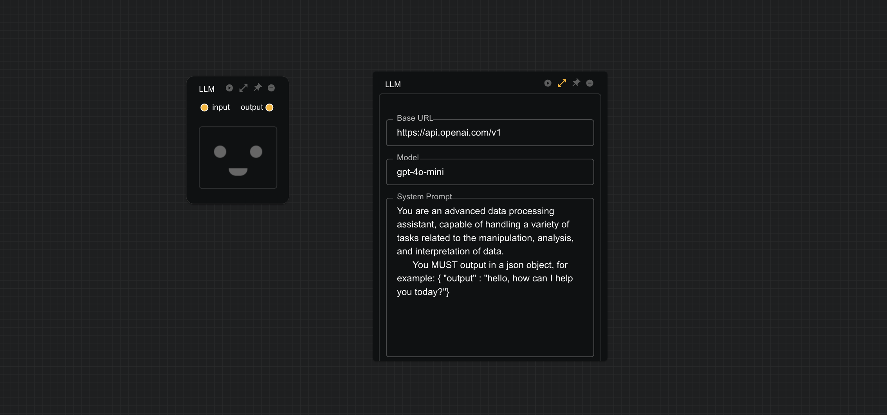

# LLM Processor

The LLM data processing module utilize LLMs to analyze and process data. The module can open the settings pannel through the `expand` button, allowing users to modify system prompts and other LLM parameters to enable the module processing data in different ways, such as semantic analysis, sentiment analysis, and more. For more detailed explanations of LLM parameters, please refer to the [AI Assistant](/workflow/assistant).

