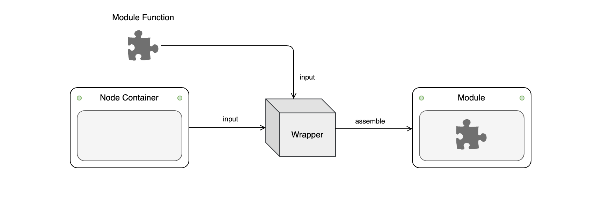
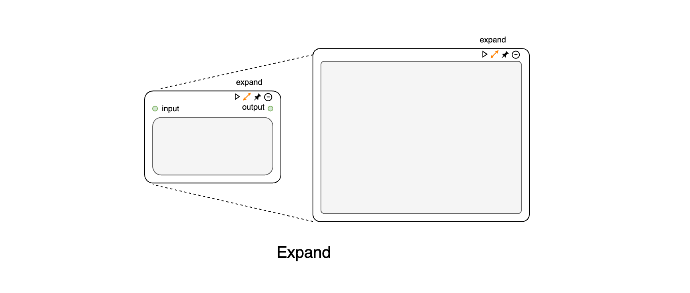
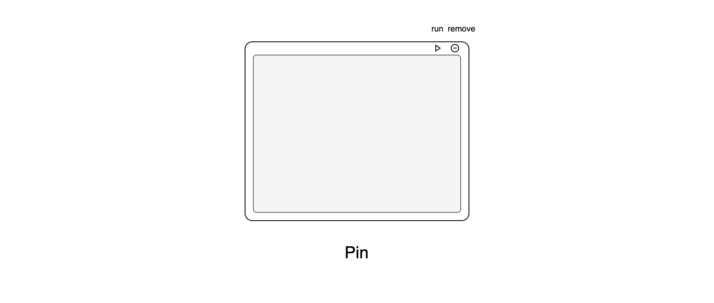

# Module / 模块

The modules of the CityFlow Platform consist of two parts: the node container and the logic code. The node container handles connections and data transmission with other nodes and provides a basic UI framework, while the logic code focuses on the implementation of the module's internal functionality. These two components are assembled through a wrapper, ensuring the independence of the module's internal logic. This architecture makes development and extension easier and allows for changing the basic UI by switching different containers without altering the internal logic (e.g., switching between the Expand Node and Pin Node containers to transition from the workflow interface to the publishing interface).

CityFlow Platform的模块由两部分组成：节点容器与逻辑代码。节点容器负责处理与其它节点的连接与数据传输，并提供了一个基础UI框架；而逻辑代码关注于模块内部功能的实现。两者通过一个打包器（wrapper）进行组装，这种架构确保了模块内部逻辑的独立性，使其更容易开发和扩展，并且能在模块内部逻辑不变的情况下，通过切换不同容器，改变模块的基础UI（如Expand Node 和 Pin Node容器的切换， 实现从工作流界面至发布界面的转换）。

The CityFlow Platform primarily includes the following four types of node containers:

CityFlow Platform 主要有以下四种节点容器：

- **Basic Node Container / 基础节点容器**

The Basic Node Container can receive input from other nodes and output processed data. Most of the system's core modules are built on the Basic Node Container, and users are not allowed to modify the module code. The Basic Node includes three buttons: `run`, `pin`, and `remove`. The `run` button executes the module code within the container; the `pin` button converts the container into a display node; and the `remove` button deletes the node.

基础节点容器可以接收其他节点输入，并输出处理数据，系统核心模块大部份搭建在基础节点容器上，不允许用户自定修改模块代码。基础节点包括`run`,`pin`和`remove`三个按钮：`run`为运行容器内模块代码的按钮；`pin`按钮将容器转换为展示型节点；`remove`按钮删除节点。

- **Expand Node Container / 扩展型节点容器**

The Expand Node Container adds a settings panel to the Basic Node, which can be opened by clicking the `expand` button. The Expand Node provides greater flexibility, and user-defined modules are built on the Expand Node Container, allowing users to customize module code and UI interfaces.

扩展节点容器在基础节点基础上，增加了一个设置面板，可以通过点击`expand`按钮打开其设置面板。扩展节点提供了更高的灵活性，用户自定义模块均基于扩展节点容器搭建，允许用户自定义模块代码和UI界面。

- **Annotation Node Container / 标注型节点容器**

The Annotation Node Container cannot receive input from other nodes and does not participate in the core logic of the workflow. It serves only for information annotation and display purposes.

标注型节点容器不能接收其他节点的输入，不参与工作流运行的核心逻辑，仅作为信息标注和展示的作用。

- **Pin Node Container / 展示型节点容器**

The Pin Node Container can receive input from other nodes and output data, but it no longer explicitly displays the connections between different nodes, and the connections between nodes cannot be modified. It is used for displaying and publishing the workflow after it is built. The Pin Node Container can be resized freely using the mouse to adapt to different interface layout requirements. Additionally, **Basic Nodes** and **Expand Nodes** can be directly converted into Pin Nodes by clicking the `pin` button.

展示型节点虽然可以接收其他节点的输入并且输出数据，但不再显式地呈现不同节点的连接方式，无法修改不同节点的连接，用于工作流搭建完成后的展示与发布界面。展示型节点可以通过鼠标自由调整容器大小，以适应不同的界面布局需求。同时**基础节点**和**扩展节点**可以通过点击`pin`按钮直接转变为展示节点。

