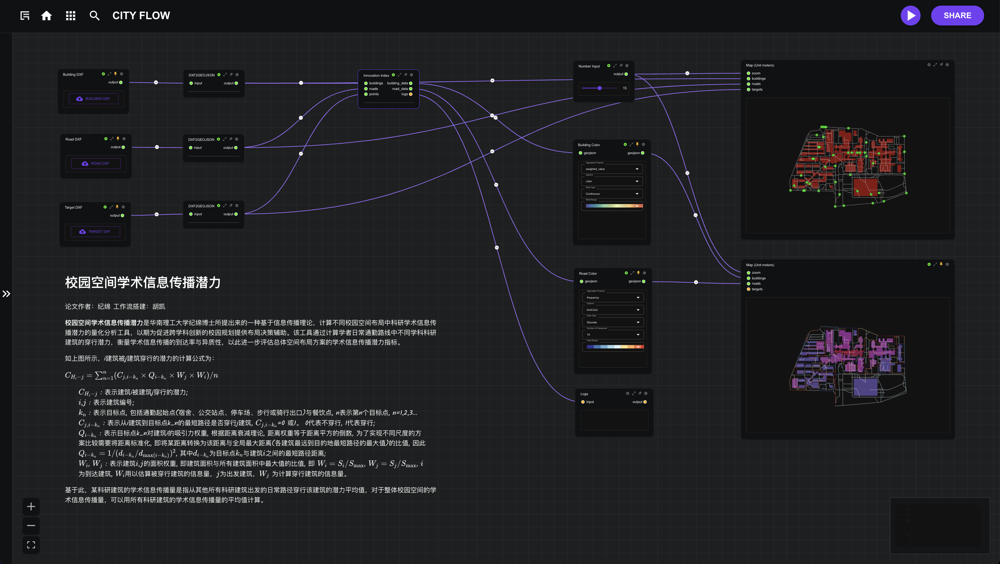
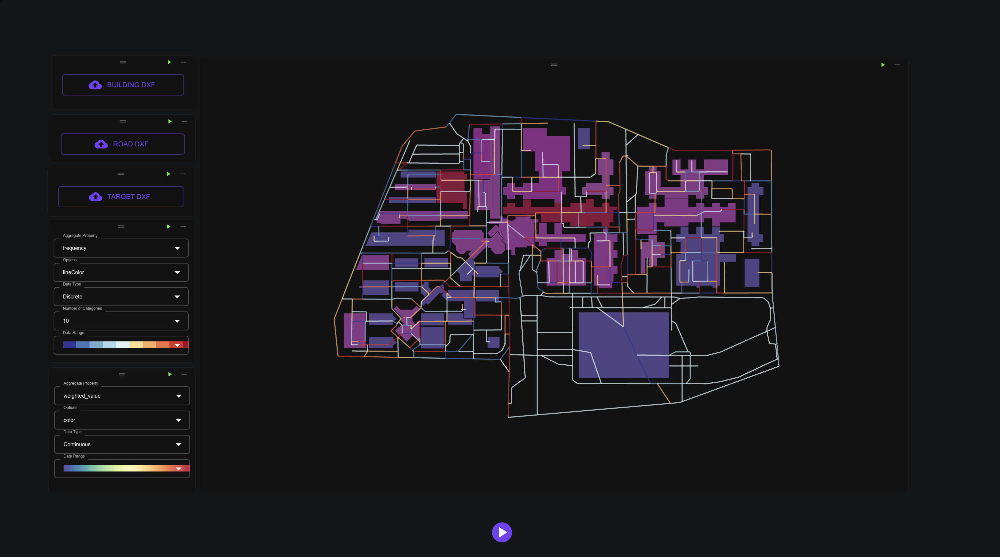

# Academic Information Dissemination Potential

Demo Workflow: [JiMian-Academic Information Dissemination Potential](https://cityflow.media.mit.edu/flow?id=3591be07cf527fc1ba74b5695d47530b)

**Academic Information Dissemination Potential** is a quantitative analysis tool proposed by Dr. Ji Mian from South China University of Technology, based on information dissemination theory. It calculates the dissemination potential of academic research information in different campus spatial layouts, aiming to provide layout decision support for promoting interdisciplinary innovation in campus planning. This tool measures the reach and heterogeneity of academic information dissemination by calculating the traversal potential of different disciplinary research buildings along scholars' daily commuting routes, further assessing the academic information dissemination indicators of the overall spatial layout scheme.


（Image created by JiMian）

As shown in the figure above, the calculation formula for the potential of building $i$ being traversed by building $j$ is:

<div style={{textAlign: "center"}}>

$$ C_{H_i-j} = \sum_{n=1}^{n}(C_{j,i-k_n} \times Q_{i-k_n} \times W_j \times W_i) / n $$

</div>

> - $C_{H_i-j}$ : Represents the potential of building i being traversed by building j; \
> - $i$,$j$ : Represents building numbers; \
> - $k_n$ : Represents the target points, including commuting starting points (dormitories, bus stations, parking lots, walking or cycling exits) and dining points, n represents the nth target point, n=1,2,3... \
> - $C_{j,i-k_n}$ : Represents whether the shortest path from building i to target point $k_n$ traverses building j, $C_{j,i-k_n}$=0 or 1. 0 represents not traversing, 1 represents traversing; \
> - $Q_{i-k_n}$ : Represents the attraction weight of target point k_n to building i. According to the distance decay theory, the distance weight is equal to the inverse square of the distance. To achieve a comparison of schemes at different scales, it is necessary to standardize the distance, that is, to convert a certain distance into the ratio of that distance to the global maximum distance (the maximum value of the shortest path from each building to the destination). Therefore, $Q_{i-k_n} = 1 / (d_{i-k_n} / d_{\text{max}(i-k_n)})^2$, where $d_{i-k_n}$ is the shortest path distance between target point $k_n$ and building $i$; \
> - $W_i$, $W_j$ : Represents the area weights of buildings $i$ and $j$, that is, the ratio of building area to the maximum area of all buildings, namely $W_i = S_i / S_{\text{max}}$, $W_j = S_j / S_{\text{max}}$. Here, $i$ denotes the destination building, and $W_i$ is used to estimate the information content of the traversed building, while $j$ denotes the origin building, and $W_j$ is used to calculate the information content of the traversing building.


Based on the above formula, the academic information dissemination volume of a certain research building refers to the average potential of daily paths from all other research buildings traversing that building, specifically defined as:

<div style={{textAlign: "center"}}>

$$ CH_i = \sum_{j=1}^{n-1} CH_{i-j} / (n-1) $$

</div>

> - $CH_i$ represents the academic information dissemination of building i \
> - $CH_{i-j}$ represents the potential for building $i$ to be passed through by building $j$ \
> - $j$ refers to the other buildings in the local group of $n$ research buildings, excluding $i$. \
> - $CH_i$ represents the academic information dissemination of a specific research building. \
> - For the overall academic information dissemination potential of a local campus space, the average academic information dissemination of all research buildings can be used as a measure.

The workflow for assessing the academic information dissemination potential in campus spaces can be divided into four parts: `Input Module`, `Path Finding Module`, `Index Calculation Module`, and `Visualization Module`:

## Input Module & Visualization Module

According to the above formula, the calculation of academic information dissemination potential in campus spaces requires the following inputs:

- Pedestrian network
- Research building layout
- Daily commuting destinations (such as dormitories, bus stops, parking lots, etc.)

Based on these data characteristics, the input data format is `.dxf` file format, and the output visualization is produced using the `deckgl` map. To read `.dxf` files, the Python `ezdxf` module needs to be used. Therefore, we enter the following information in the `packages` input box:

```yaml
pip:
  - ezdxf
```

Next, create a new Python module called `DXF2GEOJSON`, which is used for reading. The complete code can be viewed in the code editor of the `DXF2GEOJSON` module within the [workflow](https://cityflow.media.mit.edu/flow?id=3591be07cf527fc1ba74b5695d47530b).

```python
# entrypoint.py
import ezdxf
import geopandas as gpd
from shapely.geometry import Point, LineString, Polygon

def read_dwg_to_geodataframe(file_path):
    # Read the DXF file
    doc = ezdxf.readfile(file_path)
    msp = doc.modelspace()

    geometries = []
    # Iterate through all entities in the DXF file
    for idx, entity in enumerate(msp):
        if entity.dxftype() == 'POLYLINE':
            # Handle polyline
            points = [Point(vtx.dxf.location) for vtx in entity.vertices]
            if entity.is_closed:
                geometry = Polygon(points)
            else:
                geometry = LineString(points)
        else:
            # Ignore other types of entities
            continue

        # Add the geometric data to the GeoDataFrame
        geometries.append({'geometry': geometry})

    gdf = gpd.GeoDataFrame(geometries, geometry='geometry')

    return gdf
```


## Path Finding & Index Calculation Module

The core of calculating the passing potential is determining the shortest paths from research building $i$ to each daily commuting destination. The calculation process can be broken down into the following steps:

- Locate the building's entry and exit points
- Find the shortest path from the building's entry/exit points to each destination
- Calculate the frequency of passing through different buildings along the shortest path
- Weight the frequency calculated in the previous step by distance and the area of the buildings being passed through
- Repeat the above steps to calculate the passing paths for each building and the weighted frequency of passing through other buildings
- Finally, take the average of the weighted passing frequencies of all buildings as an indicator of the overall information dissemination potential

For the path finding part, we implement a road network class for unified management and use `networkx` to find the shortest paths and calculate the passing frequency for each road.

```python
class RoadNetwork:
    def __init__(self, roads_df):
        self.df = roads_df
        self.graph = momepy.gdf_to_nx(roads_df, approach="primal", multigraph=False)
        self.kd_tree, self.kd_nodes = self.build_kdtree(self.graph)
        nx.set_edge_attributes(self.graph, 0, name='frequency')
        return
    
    # Build a spatial index to efficiently find the nearest points
    def build_kdtree(self, graph):
        coords = []
        nodes = []
        for node in graph.nodes:
            coords.append(node)
            nodes.append(node)
        tree = KDTree(np.array(coords))
        return tree, nodes
    
    # Get the nearest road network node
    def find_nearest_node(self, point: Point):
        coords = point.coords[0]
        distance, index = self.kd_tree.query(np.array(coords))
        return self.kd_nodes[index]
    
    # Calculate the shortest path
    def get_path(self, start_point, target_point):
        start_node = self.find_nearest_node(start_point)
        end_node = self.find_nearest_node(target_point)
        try:
            path = nx.shortest_path(self.graph, source=start_node, target=end_node, weight='mm_len')
            if len(path) > 1:
                return LineString(path)
        except nx.NetworkXNoPath:
            return None
    
    # Update the frequency of road traversal
    def update_edge(self, path):
        edge_count = defaultdict(int)  # Used to count edge frequency
        path = list(path.coords)
        for i in range(len(path) - 1):
            edge = (path[i], path[i + 1]) 
            edge_count[edge] += 1  # Count the occurrences of the edge
        # Update the attributes of the corresponding edges in self.graph
        for edge, count in edge_count.items():
            if self.graph.has_edge(edge[0], edge[1]): 
                self.graph[edge[0]][edge[1]]['frequency'] += count  # Update frequency attribute
        return edge_count
```

The index calculation part uses a building class, as the basic calculation unit is a single building. This class is implemented to calculate and store the information for each building:

```python
class Building:
    def __init__(self, id: int, roads: RoadNetwork, geometry: Polygon):
        self.id = id
        self.geometry = geometry
        self.area = self.geometry.area
        self.entrance = []
        self.paths = []
        self.cross_value = []
        self.weighted_value = 0
        return
    
    # Get the building entrances
    def get_entrance(self, roads):
        intersections = []
        for index, row in roads.df.iterrows():
            road_geometry = row["geometry"]
            intersection = self.geometry.intersection(road_geometry)
            if not intersection.is_empty:
                # Check the type of intersection
                if intersection.geom_type == 'LineString':
                    # If it is a line segment, calculate the midpoint
                    coords = intersection.coords
                    mid_point = (
                        (coords[0][0] + coords[-1][0]) / 2,
                        (coords[0][1] + coords[-1][1]) / 2,
                        0
                    )
                    intersections.append(Point(mid_point))  # Add the midpoint
                elif intersection.geom_type == 'Point':
                    intersections.append(intersection)
        self.entrance = intersections
        return
    
    # Calculate the daily commuting paths for each building
    def find_paths(self, roads, targets):
        for entrance in self.entrance:
            for target in targets:
                path = roads.get_path(entrance, target)
                if path:
                    self.paths.append(path)
                    roads.update_edge(path)
        return
    
    # Calculate the frequency with which this building is crossed by another building
    def check_cross(self, building):
        for path in building.paths:
            for entrance in self.entrance:
                if path.intersects(entrance):
                    self.cross_value.append({
                        "source": building.id,
                        "distance": path.length,
                    })
        return
```
We then iterate over each building to calculate its passing potential. The complete code can be viewed in the `Innovation Index` module of the [workflow](https://cityflow.media.mit.edu/flow?id=ff22cf2eb4e0ea6dd580800365c9cd25).

``` python
# Build the road network
road_network = RoadNetwork(roads_df)

buildings = []
for idx, row in tqdm(building_df.iterrows(), "Calculating daily paths for each building"):
    geom = row["geometry"]
    building = Building(id=idx, roads=road_network, geometry=geom)
    # Get the entrances of the building on the road network
    building.get_entrance(roads=road_network)
    # Calculate the daily paths for each building
    building.find_paths(roads=road_network, targets=target_points)
    buildings.append(building)

# Calculate the maximum building area
max_area = max([b.area for b in buildings])
print("Maximum building area:", max_area)

# Calculate the maximum path length
all_paths = []
for b in buildings:
    all_paths.extend(b.paths)
max_path_length = max([p.length for p in all_paths])
print("Maximum path length:", max_path_length)

# Calculate the buildings crossed by the daily paths of each building
for a in tqdm(buildings, "Calculating buildings crossed by the daily paths of each building"):
    for b in buildings:
        if a.id != b.id:
            a.check_cross(b)

# Calculate the weighted sum of the crossing frequency for all buildings
for building in tqdm(buildings, "Calculating the weighted sum of crossing frequency for all buildings"):
    weighted_value = []
    for value in building.cross_value:
        # Distance weight is the inverse of the squared normalized distance
        distance_weight = 1 / (value["distance"] / max_path_length) ** 2
        # Area weight is the ratio of the crossed building area to the maximum area
        area_weight = building.area / max_area
        weighted_value.append(distance_weight * area_weight * 1)
    # Take the average value
    if len(weighted_value):
        building.weighted_value = np.mean(weighted_value)
```

## Output & Visualization Module

Finally, we use the `Mapping` module to map the road network passing frequency and the academic information dissemination potential of the buildings to different colors for display. The final result is shown in the image below:





