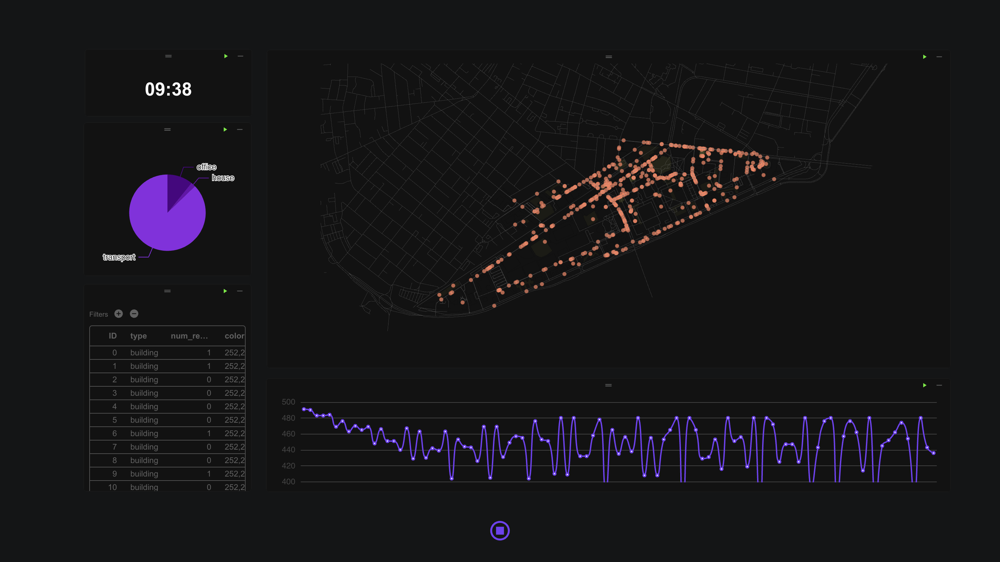

# Agent-based Model

The complete workflow for this tutorial: [MIT Campus Simulation](https://cityflow.cn/flow?id=a9c1da66d5ace18c44f054b90af46460)

Agent-based model (ABM) is a modeling approach based on individual behavior and interactions, used to simulate the dynamic evolution of complex systems. In urban simulation, ABM can be used to simulate interactions between elements such as people, traffic, and buildings in a city. By defining the behavioral rules of agents and their interactions with the environment, various phenomena in urban systems can be studied, such as commuting patterns, traffic congestion, and land-use changes. This tutorial will introduce how to build an agent-based urban simulation model on the CityFlow platform and provide detailed instructions on creating a simulation environment, writing agents, defining agent behaviors, customizing display outputs and data outputs, and running the simulation.

This tutorial mainly uses `Mesa` and `Mesa-Geo` to construct the simulation. For more information, please refer to their official documentation:

- [Mesa: Agent-based modeling in Python](https://mesa.readthedocs.io/stable/)
- [Mesa-Geo: GIS Extension for Mesa Agent-Based Modeling](https://mesa-geo.readthedocs.io/stable/)

# Creating a Simulation Environment

In urban simulation, the first step is to create a simulation environment that includes spatial information. Commonly used simulation environments include `grid environments`, where agents move within an NxN grid, and `network environments`, where agents move along road networks. This tutorial forms a network environment by loading GIS data to simulate agent activity within a campus road network. The main module for implementing simulation calculations is the `Mesa Simulator` module in the example workflow, which contains six code files:

- `entrypoint.py`: The main entry point for running the simulation;
- `kendall_model.py`: The definition file for the simulation model;
- `kendall_agent.py`: The definition file for simulation agents;
- `base_agent.py`: An auxiliary file defining basic agents, generally no modification is needed;
- `base_space.py`: An auxiliary file defining the simulation environment, generally no modification is needed;
- `base_data.py`: An auxiliary file defining the data collector, generally no modification is needed;

We first define a base model in `kendall_model.py`. Below is the basic framework of the model file; the complete file can be viewed in the `Mesa Simulator` module of the [workflow](https://cityflow.cn/flow?id=a9c1da66d5ace18c44f054b90af46460).

```python
# kendall_model.py
class Kendall(mesa.Model):
    def __init__(self,
                 road_data: dict,
                 crs: str = 'epsg:4326'):
        super().__init__()
        # GIS data coordinate system
        self.crs = crs
        # GIS road network
        road_df = gpd.GeoDataFrame.from_features(road_data['features'])
        if not road_df.crs:
            road_df.set_crs(self.crs, inplace=True)
        # Convert the GIS road network into a network for path calculation
        self.network = RoadNetwork(road_df=road_df, crs=crs)

        # Initialize the simulation environment
        self.space = CommuteSpace(crs=self.crs, warn_crs_conversion=False)

        # Define the time unit in the simulation (e.g., each step represents 1 minute), and initialize time variables
        self.minute_per_step = 1
        self.hour = 8
        self.minute = 0
        self.step_count = self.hour * 60 // self.minute_per_step + self.minute // self.minute_per_step

    def init_agents(self):
        # Function to initialize agents
        return

    def collect_data(self):
        # Function to collect output data
        return

    def step(self):
        # Function to run each step of the simulation
        return

    def get_agent_property(self, agent):
        # Function to collect agent properties
        return properties

    def get_render_data(self):
        # Function to output visualization data
        return

    # Helper function to create agents from GIS data
    def _load_from_geojson(self, key: str, data: gpd.GeoDataFrame, agent_class: mg.GeoAgent, id_key: str = "index"):
        agentcreator = mg.AgentCreator(agent_class=agent_class, model=self)
        agents = agentcreator.from_GeoDataFrame(data)
        self.space.add_agents(agents)
        self.__setattr__(key, agents)
        self.current_id = len(agents)
        return agents

    # Helper function to update time
    def _update_time(self):
        self.hour = self.step_count * self.minute_per_step // 60
        self.minute = self.step_count * self.minute_per_step % 60
```

# Creating Agents

In urban simulation, agents are the core units of the simulation. Below are the implementations of two main types of agents in `kendall_agents.py`:

- **Building Agent**

Attributes: `Number of residents inside the building`

```python
# kendall_agents.py
# Inherits GeoAgent class
class Building(mg.GeoAgent):
    def __init__(self, model, geometry, crs=None, render=True):
        # Coordinate system of the model
        if not crs:
            crs = model.crs
        super().__init__(model, geometry, crs)
        # Whether to output rendering
        self.render = render
        # Number of residents inside the building
        self.num_residents = 0

    def step(self):
        # Action function executed at each step
        return
```
- **Resident Agent**

Attributes: `house`, `office`, `speed`, `status`, `target`, etc.

```python
# kendall_agents.py
# Inherits the mobile agent `Commuter` class defined in `base_agent.py`
class Resident(Commuter):
    def __init__(self, model, geometry, crs=None, render=True):
        # Coordinate system of the model
        if not crs:
            crs = model.crs
        Commuter.__init__(self, model, geometry, crs)

        self.crs = crs
        self.house = None
        self.office = None
        self.render = render
        self.status = "office"

        # unit m/step
        self.speed = 1.2 * model.minute_per_step * 60
        self.target = None
        self.path_data = []

    def set_house(self, house):
        # Initialize home address

    def set_office(self, office):
        # Initialize workplace address

    def prepare_to_move(self):
        # Function before moving

    def move(self):
        # Function during movement

    def step(self):
        # Action function executed at each step
        self.prepare_to_move()
        self.move()
```

# Implementing Agent Behaviors

Agent behaviors are defined by the `step` method, which is called at each step of the simulation. Below are the key points of agent behavior:

- **Building Agent** : Records the number of people inside the building and updates the count at each step

```python
# kendall_agents.py
class Building(mg.GeoAgent):
    # ... other code ...
    def step(self):
        resident_points = [x.geometry for x in self.model.agents_by_type[Resident] if self.geometry.contains(x.geometry)]
        self.num_residents = len(resident_points)
```

- **Resident Agent** : 
    - `prepare_to_move`: Calculate the path based on the current time and target location
    - `move`:  Move along the path step-by-step, and switch status upon reaching the destination (e.g., from "commuting" to "working" or "home")
```python
# kendall_agents.py
class Resident(Commuter):
    # ... other code ...
    def prepare_to_move(self):
        if self.model.step_count == 8 * 60 // self.model.minute_per_step:
            self.target = self.office_point
        if self.target and self.status != "transport":
            self.origin = (self.geometry.x, self.geometry.y)
            self.destination = (self.target.x, self.target.y)
            self._prepare_to_move(self.origin, self.destination)
            self.status = "transport"

    def move(self):
        if self.target:
            self._move()
            if self.office.geometry.contains(self.geometry):
                self.status = "office"
                self.target = self.house_point
            if self.house.geometry.contains(self.geometry):
                self.status = "house"
                self.target = self.office_point
```

# Custom Data Output

The DataCollector is used to record key metrics during the simulation process, such as resident status distribution and traffic flow data. Using the DataCollector, we need to register the variables to be collected during model initialization and define the data collection method in the `collect_data` function, then call `self.datacollector.collect_data()` during each model update:

```python
# kendall_model.py
class Kendall(mesa.Model):
    def __init__(self,
                 building_data: dict,
                 road_data: dict,
                 population: int,
                 crs: str = 'epsg:4326'):
        super().__init__()

        # ... other code ...

        # Initialize the DataCollector and register the variable names to be collected
        self.datacollector = DataCollector(self)
        # record=False will only save the latest data
        self.datacollector.register("resident_status", record=False)
        # record=True will record the data collected at each step into a list
        self.datacollector.register("traffic", record=True)

    # ... other code ...

    def collect_data(self):
        # Define data calculation method
        residents = self.agents_by_type[Resident]
        self.resident_status = {
            "office": len([x for x in residents if x.status == "office"]),
            "house": len([x for x in residents if x.status == "house"]),
            "transport": len([x for x in residents if x.status == "transport"])
        }
        self.traffic = len([x for x in residents if x.status == "transport"])

    def step(self):
        # ... other code ...
        # Call data collection function
        self.datacollector.collect_data()
        self._update_time()
        self.step_count += 1
```


# Custom Display

To visualize the simulation results, we can generate GeoJSON formatted rendering data through the `get_render_data` method in the `kendall_model.py` file. This data includes:

- **`building_data`** : Includes the geometry and attributes of buildings (e.g., number of residents).
- **`resident_data`** : Includes the current position and status of residents.
- **`path`** : Records the movement paths of residents.
- **`collected_data`** : Collects resident status and traffic flow data.

```python
# kendall_model.py
class Kendall(mesa.Model):
    def __init__(self,
                 building_data: dict,
                 road_data: dict,
                 population: int,
                 crs: str = 'epsg:4326'):
        super().__init__()

    # ... other code ...

    # Agent properties used in visualization
    def get_agent_property(self, agent):
        properties = {}
        if isinstance(agent, Building):
            properties["type"] = "building"
            properties["num_resident"] = agent.num_residents
            properties["color"] = [252, 252, 68, int(agent.num_residents / 10 * 200)]
        if isinstance(agent, Resident):
            properties["status"] = agent.status
            properties["type"] = "resident"
        return properties

    # Collect data used for visualization
    def get_render_data(self):
        resident_data = []
        path = []
        building_data = {"type": "FeatureCollection", "features": []}
        for agent in self.space.agents:
            if agent.render:
                transformed_geometry = agent.get_transformed_geometry(
                    self.space.transformer
                )
                properties = self.get_agent_property(agent)
                geojson_geometry = mapping(transformed_geometry)
                if isinstance(agent, Building):
                    building_data["features"].append({
                        "type": "Feature",
                        "geometry": geojson_geometry,
                        "properties": properties,
                    })
                if isinstance(agent, Resident):
                    resident_data.append({
                        "coordinates": geojson_geometry["coordinates"],
                        "properties": properties,
                    })
                    path.append(agent.path_data)

        # Final output of visualization data
        return {'building_data': building_data,
                'resident_data': resident_data,
                'collected_data': self.datacollector.data,
                'path': path,
                'step_count': self.step_count,
                'time': '{:02d}:{:02d}'.format(self.hour, self.minute),
                }

    def step(self):
        # At each step of the simulation, call the `step` function of each Resident agent in random order
        self.agents_by_type[Resident].shuffle_do("step")
        # At each step of the simulation, call the `step` function of each Building agent in random order
        self.agents_by_type[Building].shuffle_do("step")
        # Collect data
        self.datacollector.collect_data()
        # Update time
        self._update_time()
        self.step_count += 1
```

# Running the Simulation

After obtaining the `geojson` data of the model's rendering output, we use the `deckgl` map module to visualize this data. To accelerate simulation rendering, we save the rendering output of each step to `cityflow.database` during the first simulation run. After the first run ends, cached data can be directly called for visualization, making it convenient for presentation.

The final completed workflow is shown in the figure below. The inputs for the workflow include the following parameters:

- **Max Steps** : Maximum number of steps for the simulation
- **Population** : Population size for the simulation
- **Duration** : Short wait time for each step, in milliseconds (default animation time for visualization is 2000ms; setting a reasonable wait time can make the visualization smoother)
- **Building** : `geojson` format building outline file, default geographic coordinate system is `epsg:4326`, default shape type is `Polygon`
- **Roads** : `geojson` format road network file, default geographic coordinate system is `epsg:4326`, default shape type is `LineString`

After setting the inputs, click the `run` button in the top bar of CityFlow to start the simulation.


