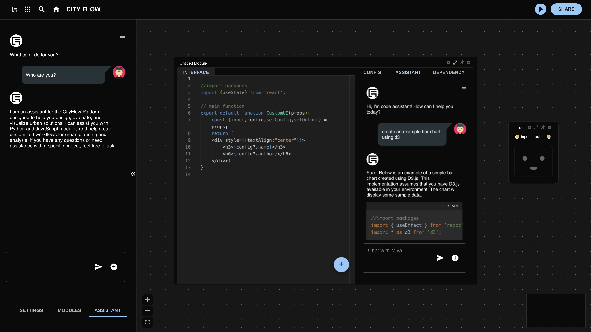
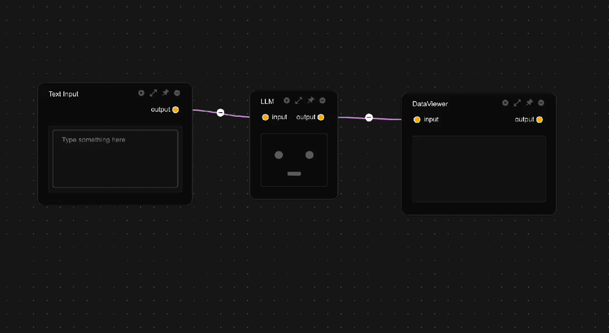

# AI Assistant

CityFlow provides three types of large language model assistants: the **Global Assistant**, the **Module Assistant**, and the **Data Assistant**, each serving different scenarios. The Global Assistant handles general tasks such as general Q&A, workflow retrieval (WIP), tool usage (WIP), etc. The Module Assistant aids in writing code for computational modules, with each module's assistant parameters set independently, allowing for tailored behavior as needed. The Data Assistant uses large language MODELs for data processing, enabling natural language transformation of the Data Assistant into various processors.

All assistants share the same API key but support independent configuration of MODEL parameters for fine-grained control.

## Assistant Types

### Global Assistant

- General Q&A consultation
- Workflow retrieval (WIP)
- Tool use (WIP)

### Module Assistant

- Computational modules can be configured independently
- Automatically obtains module context information
- Supports generating module code that meets the requirements of the cityflow platform
- **⚠️ Note: If unsure, it is not recommended to modify the system prompts of the module assistant**

### Data Assistant

- Clearly define data structure in system prompts
- It is recommended to use json_object as the output structure for subsequent processing

## Detailed Parameters

In the upper right corner of the chat interface, there is a menu button. Clicking it will switch to the large language MODEL parameter settings interface.

### Core Parameters

- system_prompt: Defines the assistant's identity and behavior with system-level prompts
- response_format: Return format (text/json_object, recommended for Data Assistant to use json). If the return format is json_object, the word json must appear in the system prompt.
- temperature: The higher the value, the more random the output (recommended 0.3-0.8)
- frequency_penalty: Suppresses repeated words (positive values penalize/negative values encourage)
- presence_penalty: Controls topic novelty (positive values explore new topics)