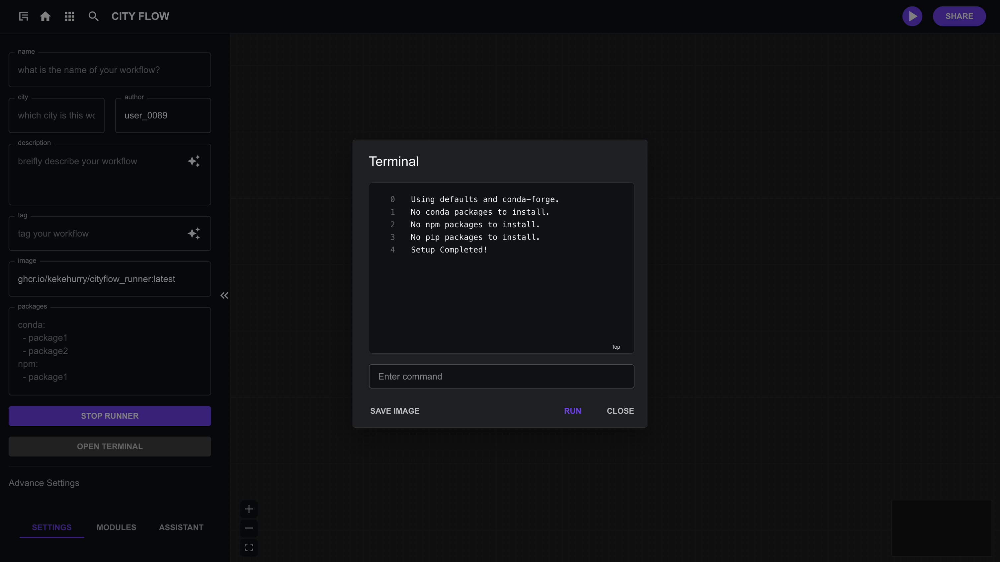

# Initial Settings / 基础设置

## Basic Information / 基本信息

When setting up a workflow, It's recommended to enter several key details in the left panel, including the workflow’s name, a description, the city involved, and the author’s name. These basic details help identify and describe the workflow clearly. The tags you add will help categorize the workflow, and the image URL lets you assign a custom image for visualization purposes.

在初始化工作流时，您可以在左侧面包输入几个关键信息，包括工作流的名称、描述、涉及的城市以及作者姓名。这些基本信息有助于清晰地识别和描述工作流。您添加的标签将帮助对工作流进行分类，而图片URL则允许您为可视化目的分配自定义图片。

**Fields** 
- Name: What is the name of your workflow? /您的工作流名称是什么
- City: Which city is this workflow for? / 该工作流适用于哪个城市？
- Author: Enter your username. / 输入您的用户名。
- Description: Provide a brief description of your workflow. / 提供工作流的简要描述。
- Tag: Tag your workflow with relevant keywords. / 使用相关关键词为工作流添加标签。
- **Image (Required)**: **CityFlow Runner** image, such as `ghcr.io/kekehurry/cityflow_runner:latest`, to associate with the workflow. / **CityFlow Runner**镜像，必填项

## Setup Cityflow Runner

There are three version of default cityflow runner images:

- **ghcr.io/kekehurry/cityflow_runner:latest**: Includes only the minimal dependencies required for the CityFlow platform. /仅包含 CityFlow 平台所需的最小依赖项.

- **ghcr.io/kekehurry/cityflow_runner:full**: Includes commonly used packages for urban research. /包含城市研究中常用的包。

You can also use your own image built upon these basic images. See terminal section to find out how to export custom image.

您也可以使用基于这些基础镜像构建的自定义镜像。请参阅`终端`部分了解如何导出自定义镜像。

### Install packages / 安装其他依赖包

In the `packages` field, you can install more dependencies. You can list the packages required for the workflow using both `conda` and `npm` and `pip`. The format should follow the `yaml` structure. For example, you might need packages like `osmnx` for Conda, and `d3` for npm. The default conda channels are `default` and `conda-forge`. You can change the channels in the configuration too.

在 `packages` 输出框中，您可以安装更多依赖项。您可以使用 `conda`、`npm` 和 `pip` 列出工作流所需的包。格式应遵循 `yaml` 结构。例如，您可能需要 `osmnx` 用于 Conda，以及 `d3` 用于 npm。默认的 conda 频道是 `default` 和 `conda-forge`。您也可以在配置中更改频道。


```yaml
conda:
  - osmnx
npm:
  - d3
pip:
  - requests
channels:
  - default
  - conda-forge
```

### Terminal

When the environment is initialized, a terminal will automatically open to display setup information, and it will close once the environment is ready. You can also use this terminal to run Linux commands inside the CityFlow runner container.

当环境初始化时，终端将自动打开以显示设置信息，并在环境准备就绪后关闭。您还可以使用此终端在 CityFlow Runner 容器内运行 Linux 命令。

In the terminal panel, you have the option to export your environment as a new CityFlow runner image by clicking the “Save Image” button. This image can then be used to initialize other workflows.

在终端面板中，您可以选择通过点击“保存镜像”按钮将您的环境导出为新的 CityFlow Runner 镜像。然后可以使用此镜像初始化其他工作流。



## Init the environment

After the init setting, click `Init Environemtn` button to start.

完成初始设置后，点击 `Init Environment` 按钮开始。

