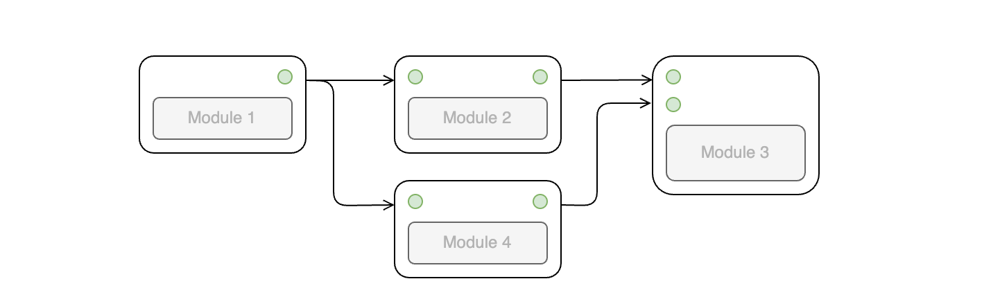

# Workflow

CityFlow Platform organizes workflows as Directed Acyclic Graphs (DAGs), where each workflow consists of different modules connected in a way that the output of one module is the input for the next. This structure provides a clearer picture of the reasoning process and enables the creation of complex workflows.

- [Init Settings](/workflow/init_settings)
- [Advanced Settings](/workflow/advanced_settings)
- [AI Assistant](/workflow/assistant)

