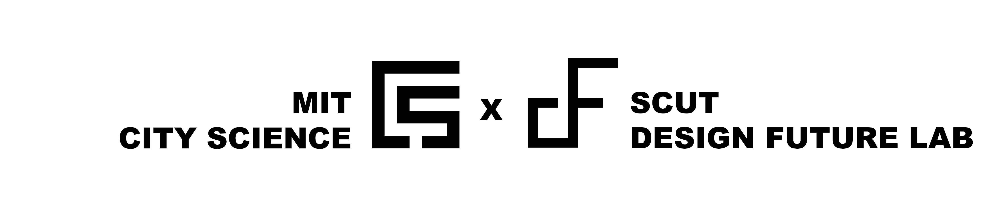

# CityFlow Platform 👋 

**创造更智能、更可持续的城市**

CityFlow 是一个低代码、AI辅助的城市设计平台，旨在帮助城市分析师、城市规划者和研究人员以最少的编码工作开发、评估和可视化城市解决方案。通过集成AI驱动的模块构建器和基于案例的协作系统，CityFlow 使用户能够创建自定义专业工作流，通过自然语言输入生成代码，并访问不断增长的城市设计知识库。平台内置AI搜索功能，促进协作，使发现、分享和改进城市规划及问题解决的创新方法变得更加容易。


**[Demo website](https://cityflow.media.mit.edu/)**

## 主要功能

### 面向城市分析师的低代码工具

CityFlow 提供了一个低代码环境，使城市分析师能够以最少的编码工作开发和测试城市模型。


### 面向模块开发者的AI编码助手

CityFlow 集成了AI驱动的模块构建器，帮助用户编写自定义的Python和JavaScript模块。通过自然语言输入，系统帮助生成和优化代码，使用户无需广泛的编程知识即可创建复杂的工作流和城市问题解决方案。


### 面向城市科学家的开放平台

CityFlow 将AI搜索引擎集成到城市工作流中，创建了一个促进专家、城市规划者和城市科学家之间协作的平台。它使用户能够搜索和分享研究成果、工作流和案例研究，为不断发展的城市设计解决方案数据库做出贡献。通过促进知识和最佳实践的交流，CityFlow使学习和应用成功规划经验，进行更有效的城市规划和管理变得更加容易，以辅助推动城市规划方法的可持续发展与创新。


## 使用Docker快速搭建 🐳

```
docker run -d --name cityflow_platform -p 3000:3000 -v //var/run/docker.sock:/var/run/docker.sock -v ${PWD}/temp:/cityflow_platform/cityflow_executor/code ghcr.io/kekehurry/cityflow_platform:latest
```

Cityflow 平台依赖[cityflow_runner](https://github.com/kekehurry/cityflow_runner.git)来执行Python和React模块。Docker容器将自动拉取最新的cityflow_runner镜像。您也可以在初始化过程之前手动拉取

```
docker pull ghcr.io/kekehurry/cityflow_runner:latest
```

# Acknowledgement

CityFlow 最初是在我访问MIT访问期间构思和开发的。衷心感谢 MIT City Science在我开发CityFlow平台期间的支持和启发。也深深感谢我的导师团队华南理工大学 Design Future Lab在整个过程中的指导和鼓励。


