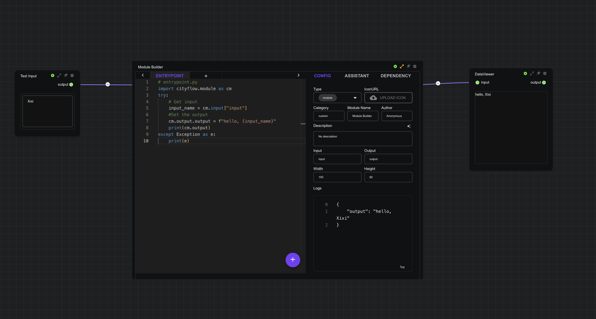
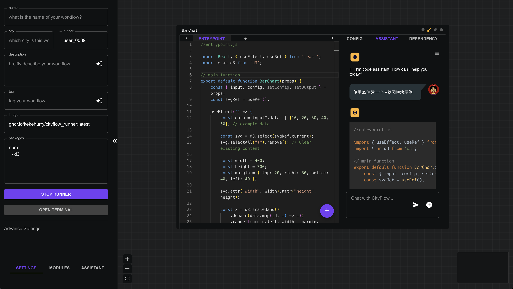
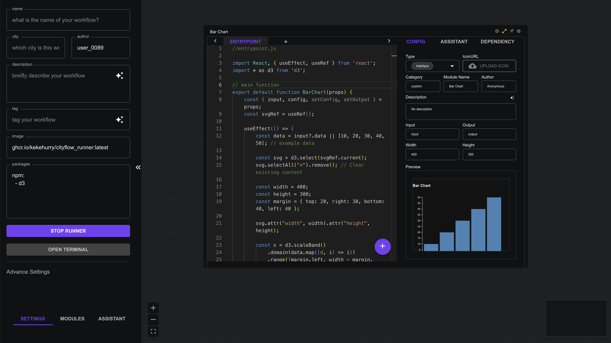

# 快速开始


## 拖拽&连接

CityFlow平台的基础操作，主要依赖于鼠标拖拽与连接：

- 新增模块：用鼠标左键从左侧模块列表选择一个模块拖拽至主界面。
- 连接两个模块：从模块输出端按住鼠标左键牵引连接线至下一个模块输入端。
- 移动模块：鼠标左键按住模块标题栏拖动
- 删除模块：点击模块右上角`remove`图标
- 复制模块：在模块上点击鼠标右键，选择`COPY`
- 粘贴模块：在模块上点击鼠标右键，选择`PASTE`，支持从另一个浏览器页面复制粘贴模块。
- 保存模块：在模块上点击鼠标右键，选择`SAVE`, 或者在代码编辑界面点击'+'按钮，选择保存。

## 创造一个自定义模块

- 将一个新的`Module Builder`模块从左侧模块列表拖至主界面, 分别将模块输入端连上一个`Text Input`模块，输出端连上一个`Data Viewer`模块。。
- 点击位于右上角的`expand`按钮，打开模块设置界面。
- 点击模块类型下拉菜单，选择`module`类型。
- 在代码编辑中，输入如下python代码：
    ```python
    # entrypoint.py
    import cityflow.module as cm
    try:
        # Get input
        input_name = cm.input["input"]
        #Set the output
        cm.output = f"hello, {input_name}"
        print(cm.output)
    except Exception as e:
        print(e)
    ```
- 点击每个模块的运行按钮，在输入端输入一个名字，查看输出信息。



## 使用AI创造一个模块

⚠️注意：使用AI功能需要参考[AI Assistant](/workflow/assistant)页面说明，设置好API KEY。

- 在左侧初始化面板的`packages`中输入以下信息安装`d3`，然后点击`Init Environment`等待安装完成。

```yaml
npm:
  - d3
```
- 将一个新的`Module Builder`模块从左侧模块列表拖至主界面，并点击位于右上角的`expand`按钮，打开模块设置界面。

- 修改模块名称为`Bar Chart`，修改模块宽度为400，高度为300。

- 点击设置界面右侧上方的`Asssistant`标签页，打开模块助手。

- 在模块助手聊天框中输入要求："使用d3创建一个柱状图模块示例"



- 等待代码生成之后，点击代码块下方`Send`按钮，将生成代码发送至编辑器。
- 切换回`Config`标签，点击'+'按钮，提交代码，等待编译完成并预览代码渲染结果。
- 点击`expand`按钮，关闭编辑界面，查看新模块。



## 保存和分享

CityFlow平台中的几种工作流保存和分享方法：

- `Ctrl`+`S`：将当前工作流保存至数据库，之后可在用户界面查看（点击`Home`图标）
- `保存`按钮：点击顶部`CityFlow Logo`图标，选择`保存`，将当前工作流保存至数据库，之后可在用户界面查看（点击`Home`图标）
- `下载`按钮：点击顶部`CityFlow Logo`图标，选择`下载`，将当前工作流所有信息下载成一个json文件，此文件可分享给他人，之后通过`上传`重新打开工作流。
- `Share`按钮：点击顶部右侧`Share`，将当前工作流分享至社区，之后可在社区界面查看(点击`Community`图标)

## 使用社区工作流

- 点击顶部工具栏`Community`图标进入社区界面
- 选择一个工作流打开，点击顶部工具栏右侧`Run`按钮即可运行社区工作流


> **Tips：**
> 在分享工作流时可以在工作流URL中添加参数以实现不同的分享效果：
> - `demo=true` : 将直接打开工作流展示界面。如`https://cityflow.cn/flow?id=aba3472421b9bea8f0347ee350dd7b34&demo=true`
> - `embed=true` : 将工作流嵌入其他网页。如`https://cityflow.cn/flow?id=aba3472421b9bea8f0347ee350dd7b34&embed=true`。下面这个窗口便是工作流嵌入的效果👇：

<iframe style={{width:100%, height:"400px"}} src="https://cityflow.cn/flow?id=aba3472421b9bea8f0347ee350dd7b34&embed=true" />