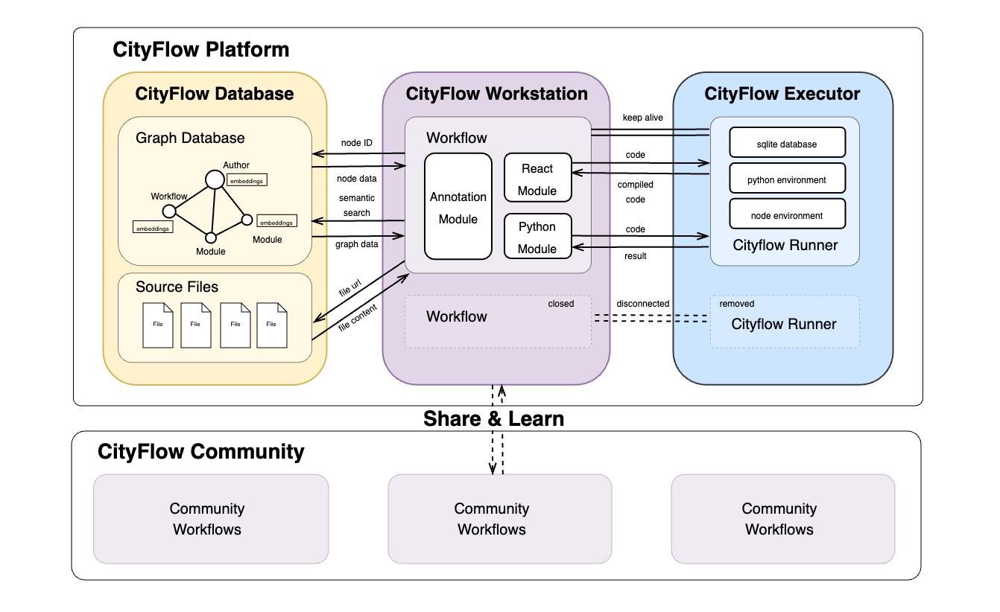

# 系统架构

CityFlow 平台的系统架构由三个核心部分组成：**CityFlow Database**、**CityFlow Workstation** 和 **CityFlow Executor**。其中，CityFlow Database 是一个图结构数据库，以节点和边的方式存储工作流信息；CityFlow Workstation 是主要的用户界面，提供了易于使用的图形化、模块化编程界面；CityFlow Executor 是负责管理工作流运行容器的组件。

## CityFlow Workstation

CityFlow Workstation 是一个类似于 `Grasshopper` 和 `ComfyUI` 的基于节点的可视化编程工作台，主要 UI 界面基于 `react-flow` 构建。CityFlow Workstation 所包含的基础模块根据其所运行的代码类型可以分为：

- **注释模块**：注释模块不参与工作流的逻辑运行，仅作为辅助说明和标记的工具。
- **React 模块**：可以编写和执行前端 React 代码。React 模块提交代码后，将由 **CityFlow Executor** 编译成浏览器可直接运行的前端代码，编译完成后便可独立运行。
- **Python 模块**：可以编写 Python 代码。Python 模块提交代码后，代码由 **CityFlow Executor** 执行，并返回运行结果，因此每次运行 Python 模块都需与 **CityFlow Executor** 连接。

## CityFlow Database

CityFlow Database 采用 Neo4J 图数据库保存工作流信息，其主要节点与边的类型有以下几种：

**节点**：
- **Author**：模块或工作流作者信息。
- **Workflow**：工作流主要信息，包括工作流的名称、作者、描述、类型、以及所包含的节点 ID 和连接的边等。
- **Module**：模块的主要信息，包括模块的名称、作者、描述、代码等。

此外，CityFlow Database 中所有节点的基本信息都通过嵌入模型 `all-MiniLM-L6-v2` 转换为向量存储，以便基于语义信息进行工作流搜索。

**边**：
- **created_by**：连接 `Module` 和 `Author` 或 `Workflow` 和 `Author`。
- **part_of**：连接 `Module` 和 `Workflow`。
- **connected_to**：连接 `Module` 和 `Module`。
- **forked_from**：连接 `Workflow` 和 `Workflow`。如果一个 `Workflow` 是基于之前的 `Workflow` 构建的，系统会自动使用 `forked_from` 添加引用信息。

基于图结构的数据库与 **CityFlow Workstation** 基于节点的 UI 界面适配度很高，并且结合大语言模型与 GraphRAG 技术，可以实现根据不同需求更准确地检索相关工作流。

## CityFlow Executor

为了确保代码运行的灵活性与安全性，CityFlow Executor 采用 Docker 容器运行不同的工作流。一个工作流的不同模块共用一个 **CityFlow Runner** 容器环境。用户可以在初始化工作流时，使用 YAML 格式配置不同的代码环境，并且每个 CityFlow Runner 容器都内置了一个临时数据库，以方便不同模块之间共享数据。CityFlow Runner 的生命周期由 CityFlow Executor 共同管理。当用户 UI 界面断开连接超过一段时间时，CityFlow Executor 将会自动销毁相应的 CityFlow Runner 容器。同时，基于容器化运行的方式也为之后实现无图形界面（headless mode）直接调用工作流预留了升级空间。

## CityFlow 社区

CityFlow 社区围绕开放协作的理念建立，致力于实现 CityFlow 平台的核心目标——**创造更智能、更可持续的城市**。通过共享研究成果、工作流和案例研究，社区成员为不断发展的城市设计解决方案库做出贡献。通过促进知识和最佳实践的交流，CityFlow 使学习和应用成功规划经验，进行更有效的城市规划和管理变得更加容易，以辅助推动城市规划方法的可持续发展与创新。