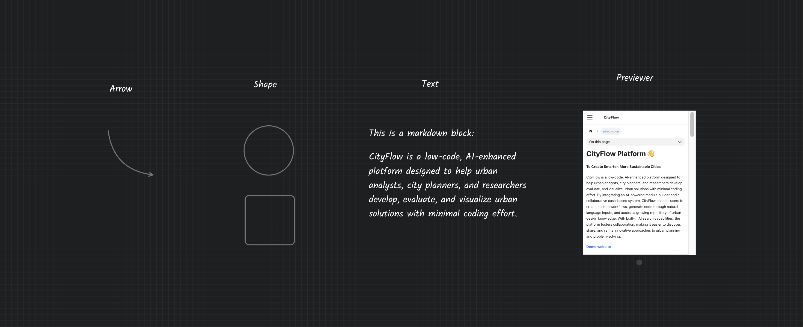

# 注释模块

注释模块不参与工作流的计算逻辑，仅作为标注元素使用。注释模块拥有隐藏工具栏，当鼠标移动到其之上是，工具会会自动显现，工具栏中的三个按钮分别是`旋转`、`缩放`和`删除`。同时注释模块支持双击进入编辑模式。CityFlow平台提供饿了四种基础注释模块：

- 箭头：一个简单的贝兹曲线箭头，可以通过双击打开控制点，调整箭头曲线。

- 形状：可通过双击切换为圆形和方形的简单形状工具。

- 文本：双击进入文本编辑模式，支持markdown格式渲染，也支持公式显示。`shift`+`Enter`提交文本修改，并退出编辑模式。

- 预览器：一个iframe网址预览组件，可嵌入其他网页视频或者网页图片等信息。

