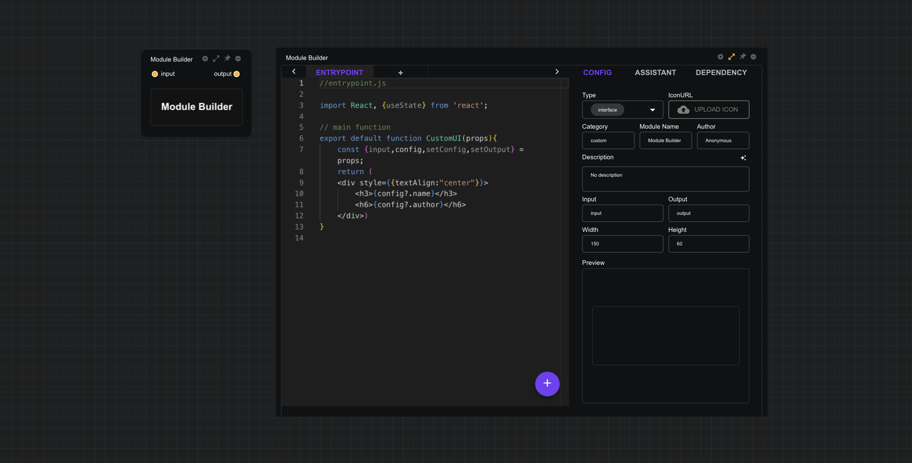

# 模块构建器

模块构建器是CityFlow Platform最核心的模块，所有用户自定义模块全部基于此模块构建。模块构建器的节点容器是一个扩展节点，拥有两种形态：UI界面和编辑界面，两种形态可通过点击`expand`图标切换。

UI界面是一个iframe容器，在隔离环境运行**CityFlow Runner**编译完成的前端代码，iframe容器内的界面元素可完全由用户通过编辑器自定义；编辑界面由两部分组成，左边是一个代码编辑器，支持多文件编辑，右边是设置界面， 设置界面由三个标签页：

- **CONFIG**
    - **Type**： 模块类型有`interface`和`module`两种，切换成`interface`类型，代码编辑器将切换为`react`代码模式，而`module`则为python代码模式。
    - **IconURL**：支持上传模块图标。
    - **Category**：自定义模块所属类别，如`GIS`、`ABM`等。
    - **Module Name**：设置模块名称将更有利于模块助手理解模块主要功能，提高代码编写准确率。
    - **Author**：模块制作作者名称。
    - **Description**：模块功能的简单描述，设置功能描述有利于模块助手理解模块主要功能，同时也支持让模块助手根据代码内容一键生成模块功能描述。
    - **Input**：模块需要的输入变量名称，每个变量名称由`,`分隔。如`input1,input2`，模块构建器将自动根据输入变量名称，生成对应变量的连接端点，以从其他模块获取输入。
    - **Output**：模块需要的输出变量名称，每个变量名称由`,`分隔。如`output1,output2`，模块构建器将自动根据输出变量名称，生成对应变量的连接端点，以输出对应数据。
    - **Width**：模块UI界面的宽度。
    - **Height**：模块UI界面的高度。
    - **Preview（when type=`interface`）**： 当模块类型为`interface`的时候，设置界面将显示一个UI预览窗口，方便调试代码。
    - **Logs （when type=`module`**：当模块类型为`module`的时候，设置界面将显示一个python代码日志信息窗口，方便调试代码。

- **ASSSISTANT** ： 模块助手可获取模块基础信息，与模块当前代码信息，以帮助用户完成模块代码的编写，模块助手可以通过其右上角的设置更改大语言模型的设置，每个模块的模块助手除共享同一个API KEY之外，其他设置互相独立，互不影响。

- **DEPENDENCY** ： 可上传额外的依赖文件。

更多关于模块构建器中`react`和`python`代码的编写方式，详见以下页面：

- [Python Module](/module/builder/python)
- [React Module](/module/builder/react)