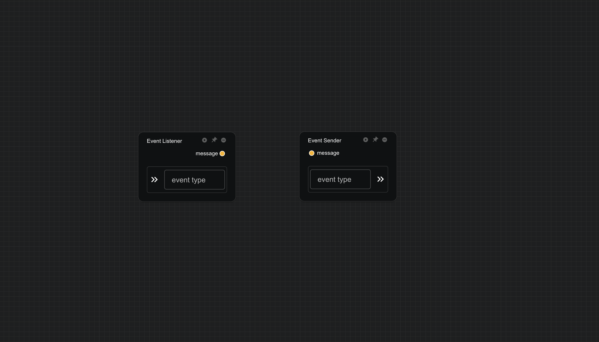

# 事件监听/发送器

在一些复杂场景中，工作流前置组件的更新可能依赖于后续组件的输出。例如，在循环模拟时，下一步模拟的初始状态依赖于上一次模拟的输出结果。为了防止工作流运行锁死，工作流本身并不直接支持循环结果，而是通过 **事件监听器** 和 **事件发送器** 组件来实现。

- **事件监听器**：该组件利用浏览器的事件监听机制，监听指定类型的事件。当所监听的事件被触发并更新时，事件监听器会将接收到的消息传输到其输出端口，供后续组件使用。

- **事件发送器**：该组件同样基于浏览器的事件机制，用于发送指定类型的事件。它拥有一个输入端口，当输入端的数据更新时，事件发送器会将输入数据通过指定的事件类型发送出去，从而触发相关的事件监听器。

通过这种基于浏览器事件机制的实现方式，**事件监听器** 和 **事件发送器** 组件能够在工作流中实现数据的异步传输和循环依赖的处理，避免了工作流锁死的问题。

