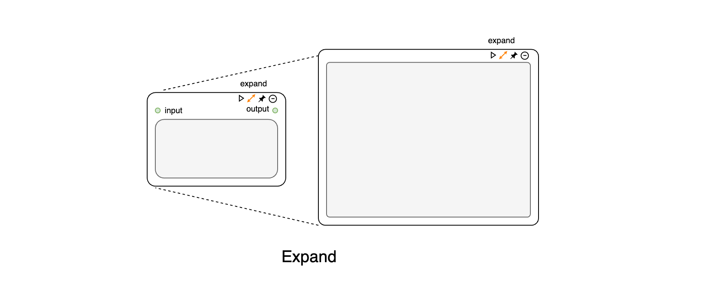
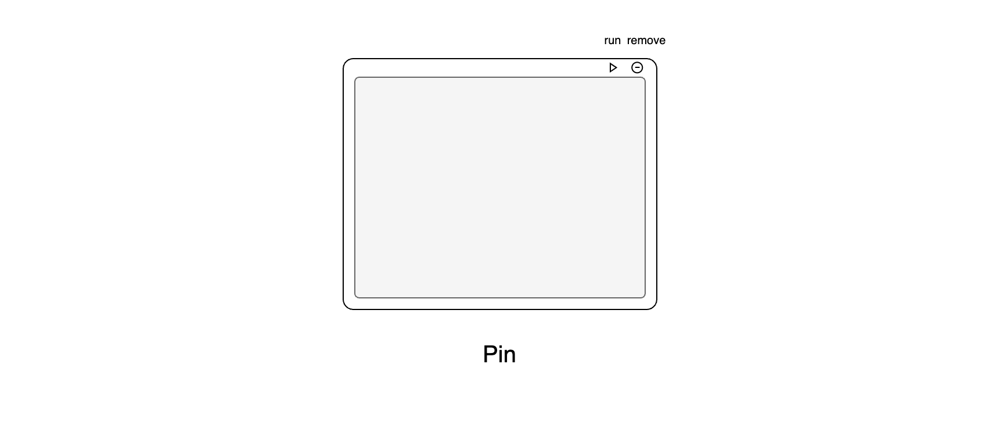

# 模块

CityFlow Platform的模块由两部分组成：节点容器与逻辑代码。节点容器负责处理与其它节点的连接与数据传输，并提供了一个基础UI框架；而逻辑代码关注于模块内部功能的实现。两者通过一个打包器（wrapper）进行组装，这种架构确保了模块内部逻辑的独立性，使其更容易开发和扩展，并且能在模块内部逻辑不变的情况下，通过切换不同容器，改变模块的基础UI（如Expand Node 和 Pin Node容器的切换， 实现从工作流界面至发布界面的转换）。

CityFlow Platform 主要有以下四种节点容器：

- **基础节点容器**

基础节点容器可以接收其他节点输入，并输出处理数据，系统核心模块大部份搭建在基础节点容器上，不允许用户自定义修改模块代码。基础节点包括`run`,`pin`和`remove`三个按钮：`run`为运行容器内模块代码的按钮；`pin`按钮将容器转换为展示型节点；`remove`按钮删除节点。

- **扩展型节点容器**

扩展节点容器在基础节点基础上，增加了一个设置面板，可以通过点击`expand`按钮打开其设置面板。扩展节点提供了更高的灵活性，用户自定义模块均基于扩展节点容器搭建，允许用户自定义模块代码和UI界面。

- **标注型节点容器**

标注型节点容器不能接收其他节点的输入，不参与工作流运行的核心逻辑，仅作为信息标注和展示的作用。

- **展示型节点容器**

展示型节点虽然可以接收其他节点的输入并且输出数据，但不再显式地呈现不同节点的连接方式，无法修改不同节点的连接，用于工作流搭建完成后的展示与发布界面。展示型节点可以通过鼠标自由调整容器大小，以适应不同的界面布局需求。同时**基础节点**和**扩展节点**可以通过点击`pin`按钮直接转变为展示节点。

