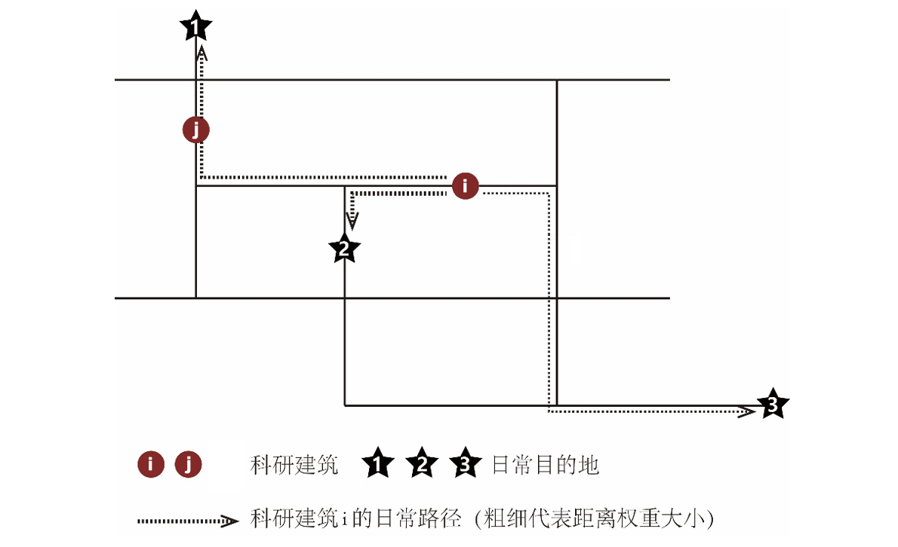

# 校园空间学术信息传播潜力

本教程完整工作流：[纪绵-校园空间学术信息传播潜力](https://cityflow.cn/flow?id=3591be07cf527fc1ba74b5695d47530b)

**校园空间学术信息传播潜力**是华南理工大学纪绵博士所提出来的一种基于信息传播理论，计算不同校园空间布局中科研学术信息传播潜力的量化分析工具，以期为促进跨学科创新的校园规划提供布局决策辅助。该工具通过计算学者日常通勤路线中不同学科科研建筑的穿行潜力，衡量学术信息传播的到达率与异质性，以此进一步评估总体空间布局方案的学术信息传播指标。

（图片来源：纪绵）

如上图所示，i建筑被j建筑穿行的潜力的计算公式为：

<div style={{textAlign: "center"}}>
$$ C_{H_i-j} = \sum_{n=1}^{n}(C_{j,i-k_n} \times Q_{i-k_n} \times W_j \times W_i) / n $$
</div>

> - $C_{H_i-j}$ : 表示建筑i被建筑j穿行的潜力; \
> - $i$,$j$ : 表示建筑编号; \
> - $k_n$ : 表示目标点, 包括通勤起始点(宿舍、公交站点、停车场、步行或骑行出口)与餐饮点, n表示第n个目标点, n=1,2,3... \
> - $C_{j,i-k_n}$ : 表示从i建筑到目标点k_n的最短路径是否穿行j建筑, $C_{j,i-k_n}$=0 或1。 0代表不穿行, 1代表穿行; \
> - $Q_{i-k_n}$ : 表示目标点$k_n$对建筑i的吸引力权重, 根据距离衰减理论, 距离权重等于距离平方的倒数, 为了实现不同尺度的方案比较需要将距离标准化, 即将某距离转换为该距离与全局最大距离(各建筑最远到目的地最短路径的最大值)的比值, 因此 $Q_{i-k_n} = 1 / (d_{i-k_n} / d_{\text{max}(i-k_n)})^2$, 其中$d_{i-k_n}$为目标点$k_n$与建筑$i$之间的最短路径距离; \
> - $W_i$, $W_j$ : 表示建筑$i$,$j$的面积权重, 即建筑面积与所有建筑面积中最大值的比值, 即 $W_i = S_i / S_{\text{max}}$, $W_j = S_j / S_{\text{max}}$, $i$ 为到达建筑, $W_i$用以估算被穿行建筑的信息量，$j$为出发建筑，$W_j$ 为计算穿行建筑的信息量。

基于上述公式，某科研建筑的学术信息传播量是指从其他所有科研建筑出发的日常路径穿行该建筑的潜力平均值，具体公式为：

<div style={{textAlign: "center"}}>
$$ CH_i = \sum_{j=1}^{n-1} CH_{i-j} / (n-1) $$
</div>

> - $CH_i$表示建筑i的学术信息传播量 \
> - $CH_{i-j}$表示$i$建筑被$j$建筑穿行的潜力 \
> - $j$为局部n栋科研建筑中除$i$外的其他科研建筑。\
> - $CH_i$代表的是某一科研建筑的学术信息传播量 \
> - 对于整体校园空间局部的学术信息传播量，可以用所有科研建筑的学术信息传播量平均值衡量。

校园空间学术信息传播潜力评估工作流的搭建，可分为`方案输入模块`、`路径寻找模块`、`指标计算模块`和`可视化模块`四个部分：

## 方案输入模块 & 可视化模块

根据上述公式，校园空间学术信息传播潜力的计算的需要以下几个输入：

- 穿行路网
- 科研建筑布局
- 日常通勤目的点（如宿舍、公交站点、停车场等等）

根据这些数据特征，数据输入格式采用`.dxf`文件格式，输出可视化采用`deckgl`地图。读取`.dxf`格式文件需要使用python的`ezdxf`模块。因此我们在`packages`输入框中输入以下信息：
```yaml
pip:
  - ezdxf
```
然后新建一个`DXF2GEOJSON`的python模块，这是读取部分代码，完整代码可以打开[工作流](https://cityflow.cn/flow?id=3591be07cf527fc1ba74b5695d47530b)内`DXF2GEOJSON`模块的代码编辑器查看。
```python
#entrypoint.py
import ezdxf
import geopandas as gpd
from shapely.geometry import Point, LineString, Polygon

def read_dwg_to_geodataframe(file_path):
    # 读取DXF文件
    doc = ezdxf.readfile(file_path)
    msp = doc.modelspace()

    geometries = []
    # 遍历DXF文件中的所有实体
    for idx,entity in enumerate(msp):
        if entity.dxftype() == 'POLYLINE':
            # 处理多段线
            points = [Point(vtx.dxf.location) for vtx in entity.vertices]
            if entity.is_closed:
                geometry = Polygon(points)
            else:
                geometry = LineString(points)
        else:
            # 忽略其他类型的实体
            continue

        # 将几何数据添加到GeoDataFrame中
        geometries.append({'geometry': geometry})

    gdf = gpd.GeoDataFrame(geometries, geometry='geometry')

    return gdf
```


## 路径寻找 & 指标计算模块

计算穿行潜力的核心是计算从科研建筑i出发前往各日常通行目的点的最短路径，其计算过程可以分为以下几步：

- 寻找建筑出入口位置
- 寻找从建筑出入口出发前往各目的点的最短路径
- 计算最短路径中穿行不同建筑的频率
- 以距离和被穿行建筑面积权重对上一步计算的频率进行加权
- 重复上述步骤，计算每一栋建筑的穿行路径以及穿行其他建筑的加权频率
- 最后取所有建筑加权穿行频率的平均值作为衡量整体信息传播潜力的指标


路径寻找部分我们通过实现一个路网类统一管理，并采用`networkx`来实现最短路径寻找以及每条道路穿行频率的统计：

```python
class RoadNetwork:
    def __init__(self,roads_df):
        self.df = roads_df
        self.graph = momepy.gdf_to_nx(roads_df, approach="primal", multigraph=False)
        self.kd_tree, self.kd_nodes = self.build_kdtree(self.graph)
        nx.set_edge_attributes(self.graph, 0, name='frequency')
        return
    
    #建立空间索引以高效寻找最近点
    def build_kdtree(self,graph):
        coords = []
        nodes = []
        for node in graph.nodes:
            coords.append(node)
            nodes.append(node)
        tree = KDTree(np.array(coords))
        return tree, nodes
    
    #获取最近的路网节点
    def find_nearest_node(self, point: Point):
        coords = point.coords[0]
        distance, index = self.kd_tree.query(np.array(coords))
        return self.kd_nodes[index]
    
    #计算最短路径
    def get_path(self, start_point, target_point):
        start_node = self.find_nearest_node(start_point)
        end_node = self.find_nearest_node(target_point)
        try:
            path = nx.shortest_path(self.graph, source=start_node, target=end_node, weight='mm_len')
            if len(path)>1:
                return LineString(path)
        except nx.NetworkXNoPath:
            return None
    
    #更新道路穿行频率
    def update_edge(self, path):
        edge_count = defaultdict(int)  # 用于统计边频率
        path = list(path.coords)
        for i in range(len(path) - 1):
            edge = (path[i], path[i + 1]) 
            edge_count[edge] += 1  # 统计边的出现次数
        # 更新self.graph中对应边的属性
        for edge, count in edge_count.items():
            if self.graph.has_edge(edge[0], edge[1]): 
                self.graph[edge[0]][edge[1]]['frequency'] += count  # 更新频率属性
        return edge_count 
```

指标计算部分由于基本计算单元为一栋建筑，我们实现一个建筑类，来计算并保存每一栋建筑的信息：

```python
class Building:
    def __init__(self,id:int,roads : RoadNetwork,geometry:Polygon):
        self.id = id
        self.geometry = geometry
        self.area = self.geometry.area
        self.entrance = []
        self.paths = []
        self.cross_value=[]
        self.weighted_value=0
        return
    # 获取建筑出入口
    def get_entrance(self,roads):
        intersections = []
        for index, row in roads.df.iterrows():
            road_geometry = row["geometry"]
            intersection = self.geometry.intersection(road_geometry)
            if not intersection.is_empty:
                # 检查交集的类型
                if intersection.geom_type == 'LineString':
                    # 如果是线段，计算中点
                    coords = intersection.coords
                    mid_point = (
                        (coords[0][0] + coords[-1][0]) / 2,
                        (coords[0][1] + coords[-1][1]) / 2,
                        0
                    )
                    intersections.append(Point(mid_point))  # 添加中点
                elif intersection.geom_type == 'Point':
                    intersections.append(intersection)
        self.entrance = intersections
        return
    # 计算每栋建筑的日常通勤路径
    def find_paths(self,roads,targets):
        for entrance in self.entrance:
            for target in targets:
                path = roads.get_path(entrance, target)
                if path:
                    self.paths.append(path)
                    roads.update_edge(path)
        return
    # 计算该建筑被另一栋建筑穿行的频率
    def check_cross(self,building):
        for path in building.paths:
            for entrance in self.entrance:
                if path.intersects(entrance):
                    self.cross_value.append({
                        "source": building.id,
                        "distance" : path.length,
                    })
        return
```
然后我们遍历每一栋建筑计算穿行潜力, 完整代码可通过[工作流](https://cityflow.cn/flow?id=ff22cf2eb4e0ea6dd580800365c9cd25)`Innovation Index`模块查看。

``` python
# 建立路网

road_network = RoadNetwork(roads_df)

buildings = []
for idx, row in tqdm(building_df.iterrows(),"计算每栋建筑的日常路径"):
    geom = row["geometry"]
    building = Building(id=idx, roads=road_network, geometry=geom)
    # 获取建筑在路网上的出入口
    building.get_entrance(roads=road_network)
    # 计算每栋建筑的日常路径
    building.find_paths(roads=road_network, targets = target_points)
    buildings.append(building)


# 计算最大建筑面积
max_area = max([b.area for b in buildings])
print("最大建筑面积:",max_area)
# 计算最大路径长度
all_paths = []
for b in buildings:
    all_paths.extend(b.paths)
max_path_length = max([ p.length for p in all_paths])
print("最大路径长度:", max_path_length)


# 计算每栋建筑日常路径所穿行建筑
for a in tqdm(buildings,"计算每栋建筑日常路径所穿行建筑"):
    for b in buildings:
        if a.id != b.id :
            a.check_cross(b)

# 对所有建筑被穿行频率加权求和
for building in tqdm(buildings,"对所有建筑被穿行频率加权求和"):
    weighted_value = []
    for value in building.cross_value:
        #距离权重为标准化距离平方的倒数
        distance_weight = 1/(value["distance"]/max_path_length)**2
        #面积权重为被穿行建筑面积与最大面积比值
        area_weight = building.area/max_area
        weighted_value.append(distance_weight*area_weight*1)
    #取平均值
    if len(weighted_value) :
        building.weighted_value = np.mean(weighted_value)
```

## 输出与可视化模块

最后我们采用`Mapping`模块将路网穿行频率和建筑学术信息传播潜力映射为不同颜色显示，最终效果如下图所示：


