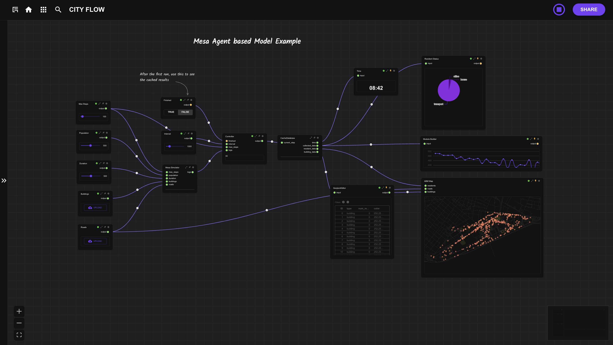
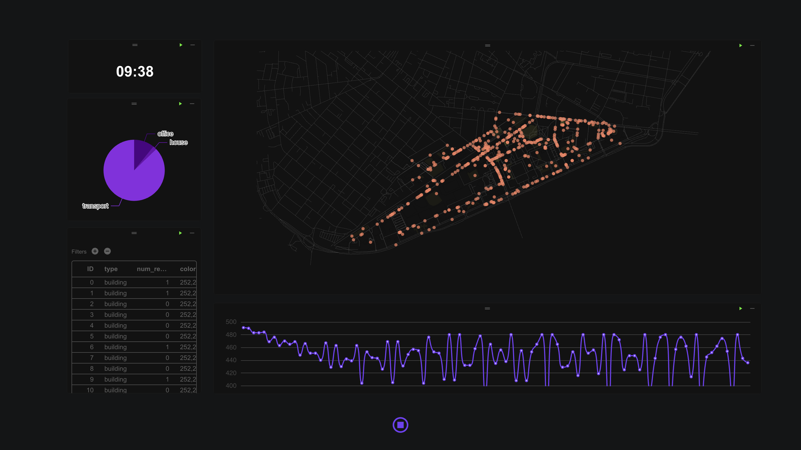

# 智能体仿真模型

本教程完整工作流： [MIT校园仿真](https://cityflow.cn/flow?id=5d6850cb5ddc1e0d6954e32847ecbf5e)

Agent-based model (ABM) 是一种基于个体行为和交互的建模方法，用于模拟复杂系统的动态演化。在城市仿真中，ABM 可以用来模拟城市中人群、交通、建筑等元素之间的相互作用。通过定义智能体（agents）的行为规则及其与环境的交互，可以研究城市系统中的各种现象，例如通勤模式、交通拥堵、土地利用变化等。本教程将介绍在CityFlow平台中如何构建一个基于智能体的城市仿真模型，并详细说明如何创建仿真环境、编写智能体、定义智能体行为、自定义显示输出和数据输出，以及运行仿真模拟。

本教程主要使用 `Mesa` 和 `Mesa-Geo` 构建仿真模拟，更多信息可查看其官方文档：

- [Mesa: Agent-based modeling in Python](https://mesa.readthedocs.io/stable/)
- [Mesa-Geo: GIS Extension for Mesa Agent-Based Modeling](https://mesa-geo.readthedocs.io/stable/)

# 创建仿真环境

在城市仿真中，首先需要创建一个包含空间信息的仿真环境。常用的仿真环境有`网格环境`，让智能体在NxN的网格中活动，以及`网络环境`，让智能体在道路形成路网中活动。本教程通过加载GIS数据形成一个网络环境，模拟智能体在校园路网中的活动。实现仿真计算的主要模块，是示例工作流中的`Mesa Simulator`模块，该模块中共有6个代码文件：

- `entrypoint.py` : 运行仿真的主入口；
- `kendall_model.py` : 仿真模型的定义文件；
- `kendall_agent.py` : 仿真智能体的定义文件；
- `base_agent.py`: 定义基础智能体的辅助文件，一般情况下无需修改;
- `base_space.py` : 定义仿真环境的辅助文件，一般情况下无需修改;
- `base_data.py` : 定义数据收集器的辅助文件，一般情况下无需修改;

我们首先在`kendall_model.py`中定义一个基础模型，下面是模型文件的基本框架，完整文件可在[工作流](https://cityflow.cn/flow?id=a9c1da66d5ace18c44f054b90af46460)中的`Mesa Simulator`模块查看。

```python
#kendall_model.py
class Kendall(mesa.Model):
    def __init__(self,
                 road_data:dict,
                 crs:str ='epsg:4326'):
        super().__init__()
        # GIS数据坐标系
        self.crs = crs
        # GIS路网
        road_df = gpd.GeoDataFrame.from_features(road_data['features'])
        if not road_df.crs:
            road_df.set_crs(self.crs,inplace=True)
        # 将GIS路网转换为网络方便进行路径计算
        self.network = RoadNetwork(road_df=road_df, crs=crs)

        #初始化仿真环境
        self.space = CommuteSpace(crs=self.crs,warn_crs_conversion=False)

        #定义仿真中的时间单位（如每步代表 1 分钟），并初始化时间变量
        self.minute_per_step = 1
        self.hour = 8
        self.minute = 0
        self.step_count = self.hour*60//self.minute_per_step + self.minute//self.minute_per_step
    
    def init_agents(self):
        #初始化智能体的函数
        return
    
    def collect_data(self):
        #收集输出数据的函数
        return

    def step(self):
        #每一步仿真运行的函数
        return

    def get_agent_property(self,agent):
        #收集智能体属性的函数
        return properties

    def get_render_data(self):
        # 输出可视化数据的函数
        return 

    # 从GIS数据创建智能体的辅助函数
    def _load_from_geojson(self, key:str, data:gpd.GeoDataFrame, agent_class:mg.GeoAgent, id_key:str="index"):
        agentcreator = mg.AgentCreator(agent_class=agent_class, model=self)
        agents = agentcreator.from_GeoDataFrame(data)
        self.space.add_agents(agents)
        self.__setattr__(key,agents)
        self.current_id = len(agents)
        return agents
    
    # 更加仿真时间的辅助函数
    def _update_time(self):
        self.hour = self.step_count * self.minute_per_step // 60
        self.minute = self.step_count * self.minute_per_step % 60
```

# 智能体编写

在城市仿真中，智能体是模拟的核心单元。以下是`kendall_agents.py`两种主要智能体的实现：

- **建筑智能体**

属性：`建筑物内人群数量`

```python
#kendall_agents.py
# 继承 GeoAgent 类
class Building(mg.GeoAgent):
    def __init__(self, model, geometry, crs=None, render=True):
        # 模型的坐标系
        if not crs:
            crs = model.crs
        super().__init__(model, geometry, crs)
        # 是否输出渲染
        self.render = render
        # 建筑物内人群数量
        self.num_residents = 0
    def step(self):
        # 每一步中执行的动作函数
        return 
```
- **人群智能体**

属性：`居住地点`、`办公地点`、`速度`、`当前状态`、`当前目的地`等

```python
#kendall_agents.py
#继承`base_agent.py`中定义好的可移动智能体`Commuter`类
class Resident(Commuter):
    def __init__(self, model, geometry, crs=None, render=True):
        #模型的坐标系
        if not crs:
            crs = model.crs
        Commuter.__init__(self,model, geometry, crs)

        self.crs = crs
        self.house = None
        self.office = None
        self.render = render
        self.status = "office"

        #unit m/step
        self.speed = 1.2*model.minute_per_step*60
        self.target = None
        self.path_data = []

    def set_house(self, house):
        # 初始化家庭地址


    def set_office(self, office):
        # 初始化办公地址
    
    def prepare_to_move(self):
        # 移动之前的功能函数
        
    def move(self):
        # 移动中的功能函数

    def step(self):
        # 每一步中执行的动作函数
        self.prepare_to_move()
        self.move()
```

# 智能体行为编写

智能体的行为由 step 方法定义，该方法在每一步仿真时调用。以下是智能体行为的关键点：

- **建筑智能体** : 记录建筑物内的人群数量，并在每一步更新人群数量

```python
#kendall_agents.py
class Building(mg.GeoAgent):
    # ... 其他代码 ... #
    def step(self):
        resident_points = [x.geometry for x in self.model.agents_by_type[Resident] if self.geometry.contains(x.geometry)]
        self.num_residents = len(resident_points)
```

- **人群智能体** : 
    - 准备移动 ：根据当前时间和目标位置计算路径
    - 移动 ：沿着路径逐步移动，并在到达目的地后切换状态（如从“通勤”到“办公”或“居家”）

```python
#kendall_agents.py
class Resident(Commuter):
     # ... 其他代码 ... #
    def prepare_to_move(self):
        if self.model.step_count == 8 * 60 // self.model.minute_per_step:
            self.target = self.office_point
        if self.target and self.status != "transport":
            self.origin = (self.geometry.x, self.geometry.y)
            self.destination = (self.target.x, self.target.y)
            self._prepare_to_move(self.origin, self.destination)
            self.status = "transport"

    def move(self):
        if self.target:
            self._move()
            if self.office.geometry.contains(self.geometry):
                self.status = "office"
                self.target = self.house_point
            if self.house.geometry.contains(self.geometry):
                self.status = "house"
                self.target = self.office_point
```
# 自定义数据输出
数据收集器（DataCollector）用于记录仿真过程中的关键指标，例如居民状态分布和交通流量等数据。使用数据收集器，我们需要在模型初始化时，注册需要收集的变量，并在`collect_data`函数中定义数据的收集方式，然后在模型更一步更新中调用`self.datacollector.collect_data()`:

```python
#kendall_model.py
class Kendall(mesa.Model):
    def __init__(self,
                 building_data:dict,
                 road_data:dict,
                 population:int,
                 crs:str ='epsg:4326'):
        super().__init__()

        # ... 其他代码 ...

        #初始化数据收集器，注册需要收集的变量名称
        self.datacollector = DataCollector(self)
        # record=False 只会保存最新的数据
        self.datacollector.register("resident_status",record=False)
        # record=True 会将每一步收集的数据记录成一个列表
        self.datacollector.register("traffic",record=True)
    
    # ... 其他代码 ...

    def collect_data(self):
        #定义数据计算方式
        residents = self.agents_by_type[Resident]
        self.resident_status = {
            "office" : len([x for x in residents if x.status=="office"]),
            "house" : len([x for x in residents if x.status=="house"]),
            "transport" : len([x for x in residents if x.status == "transport"])
        }
        self.traffic = len([x for x in residents if x.status == "transport"])

    def step(self):
        # ... 其他代码 ...
        # 调用收集数据函数
        self.datacollector.collect_data()
        self._update_time()
        self.step_count += 1
```


# 自定义显示输出

为了可视化仿真结果，我们可以通过 `kendall_model.py`文件中`get_render_data` 方法生成 GeoJSON 格式的渲染数据。这些数据包括：

- **建筑物数据** ：包含建筑物的几何形状和属性（如居民数量）。
- **居民数据** ：包含居民的当前位置和状态。
- **路径数据** ：记录居民的移动路径。
- **统计数据** ：收集的居民状态和交通流量数据。

```python
#kendall_model.py
class Kendall(mesa.Model):
    def __init__(self,
                 building_data:dict,
                 road_data:dict,
                 population:int,
                 crs:str ='epsg:4326'):
        super().__init__()
    
    # ... 其他代码 ...

    # 可视化中需要使用的agent属性
    def get_agent_property(self,agent):
        properties = {}
        if isinstance(agent, Building):
            properties["type"] = "building"
            properties["num_resident"] = agent.num_residents
            properties["color"] = [252, 252, 68, int(agent.num_residents/10*200)]
        if isinstance(agent, Resident):
            properties["status"] = agent.status
            properties["type"] = "resident"
        return properties

    # 收集可视化需要用到的数据
    def get_render_data(self):
        resident_data = []
        path = []
        building_data = {"type": "FeatureCollection", "features": []}
        for agent in self.space.agents:
            if agent.render:
                transformed_geometry = agent.get_transformed_geometry(
                    self.space.transformer
                )
                properties = self.get_agent_property(agent)
                geojson_geometry = mapping(transformed_geometry)
                if isinstance(agent, Building):
                    building_data["features"].append({
                        "type": "Feature",
                        "geometry": geojson_geometry,
                        "properties": properties,
                        })
                if isinstance(agent, Resident):
                    resident_data.append({
                        "coordinates":geojson_geometry["coordinates"],
                        "properties": properties,
                    })
                    path.append(agent.path_data)

        # 最终输出的可视化数据
        return {'building_data':building_data,
                'resident_data':resident_data,  
                'collected_data':self.datacollector.data,
                'path':path,
                'step_count':self.step_count,
                'time' : '{:02d}:{:02d}'.format(self.hour,self.minute),
                }

    def step(self):
        # 每一步仿真中以随机顺序调用每一个Resident智能体的step函数
        self.agents_by_type[Resident].shuffle_do("step")
        # 每一步仿真中以随机顺序调用每一个Building智能体的step函数
        self.agents_by_type[Building].shuffle_do("step")
        # 收集数据
        self.datacollector.collect_data()
        # 更新时间
        self._update_time()
        self.step_count += 1
```


# 运行仿真模拟

获取模型渲染输出的`geojson`数据后，我们使用`deckgl`地图模块可视化这些数据，为了加速模拟渲染，我们在第一次运行模拟时，将每一步输出的渲染输出保存至`cityflow.database`，这样在第一次运行结束后，可以直接调用缓存数据进行可视化，以方便展示。

最终搭建完成的工作流如下图所示，工作流的输入有以下几个参数：

- **Max Steps** :  仿真模拟最大运行步数
- **Population** :  仿真模拟的人口数
- **Duration** : 每一步短暂等待的时间，单位为毫秒。（默认可视化渲染的动画时间为2000ms，合理设置等待时间可以让可视化效果更加流畅）
- **Building** : `geojson`格式建筑轮廓文件，地理坐标系默认为`epsg:4326`，形状类型默认为`Polygon`
- **Roads** : `geojson`格式路网文件，地理坐标系默认为`epsg:4326`，形状类型默认为`LineString`

输入设置完成之后，点击CityFlow顶部栏的运行按钮，即可运行仿真模拟。


