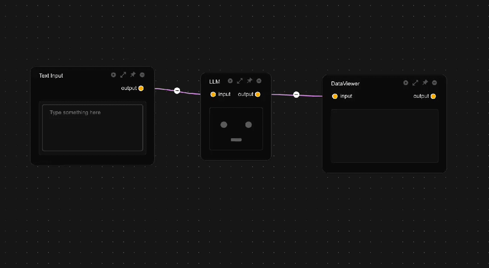

# AI 助手

CityFlow 提供三种大语言模型助手，全局助手、模块助手和数据助手，分别服务于不同场景。全局助手负责通用任务的处理，如通用问答、工作流检索（WIP）、工具使用（WIP）等等；模块助手辅助计算模块代码的编写，每一个模块的助手参数设置都互相独立，因此可以根据需要配置模块的不同行为；数据助手以大语言模型进行数据处理，可以用自然语言将数据助手化身不同的处理器。

所有助手共享同一API密钥，但支持独立配置模型参数，实现精细化控制。

## 助手类型详解

### 全局助手

- 通用问答咨询
- 工作流程检索（开发中）
- 工具调用（开发中）

### 模块助手

- 计算模块可独立配置
- 自动获取模块上下文信息
- 支持生成符合cityflow platform平台要求的模块代码
- **⚠️ 注意：若无把握，不建议修改模块助手的系统提示词**

### 数据助手

- 在系统提示中明确数据结构
- 建议使用`json_object`作为输出结构以便后续处理

## 详细参数设置

在聊天界面右上角，有一个菜单按钮，点击之后会切换到，大语言模型参数设置界面

### 核心参数说明

- system_prompt: 定义助手身份和行为的系统级提示词
- response_format: 返回格式(text/json_object,推荐数据助手使用json),返回格式为`json_object`则在系统提示词中必须出现`json`字样。
- temperature: 值越高输出越随机（建议0.3-0.8）
- frequency_penalty: 抑制重复用词（正值惩罚/负值鼓励）
- presence_penalty: 控制话题新颖度（正值探索新主题）