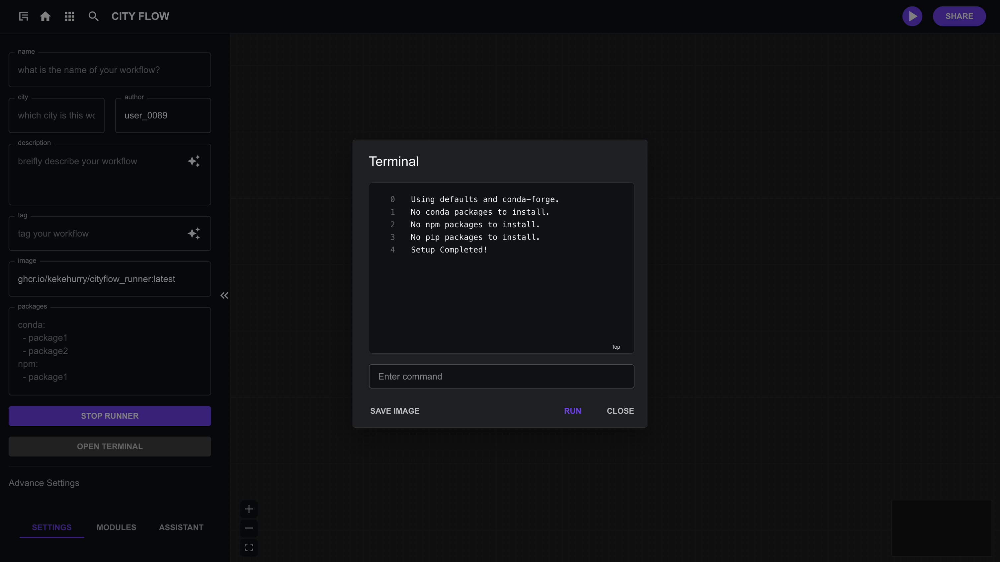

# 基础设置

## 基本信息

在初始化工作流时，您可以在左侧面包输入几个关键信息，包括工作流的名称、描述、涉及的城市以及作者姓名。这些基本信息有助于清晰地识别和描述工作流。您添加的标签将帮助对工作流进行分类，而图片URL则允许您为可视化目的分配自定义图片。

**字段**
- 名称: 您的工作流名称是什么
- 城市: 该工作流适用于哪个城市？
- 作者: 输入您的用户名。
- 描述: 提供工作流的简要描述。
- 标签: 使用相关关键词为工作流添加标签。
- **图片 (必填)**: **CityFlow Runner**镜像，必填项

## 设置 Cityflow Runner

默认的 Cityflow Runner 镜像有三个版本：

- **ghcr.io/kekehurry/cityflow_runner:latest**: 仅包含 CityFlow 平台所需的最小依赖项。
- **ghcr.io/kekehurry/cityflow_runner:full**: 包含城市研究中常用的包。

您也可以使用基于这些基础镜像构建的自定义镜像。请参阅`终端`部分了解如何导出自定义镜像。

### 安装其他依赖包

在 `packages` 输出框中，您可以安装更多依赖项。您可以使用 `conda`、`npm` 和 `pip` 列出工作流所需的包。格式应遵循 `yaml` 结构。例如，您可能需要 `osmnx` 用于 Conda，以及 `d3` 用于 npm。默认的 conda 频道是 `default` 和 `conda-forge`。您也可以在配置中更改频道。
```yaml
conda:
  - osmnx
npm:
  - d3
pip:
  - requests
channels:
  - default
  - conda-forge
```

### 终端

当环境初始化时，终端将自动打开以显示设置信息，并在环境准备就绪后关闭。您还可以使用此终端在 CityFlow Runner 容器内运行 Linux 命令。

在终端面板中，您可以选择通过点击“保存镜像”按钮将您的环境导出为新的 CityFlow Runner 镜像。然后可以使用此镜像初始化其他工作流。



## 初始化环境

完成初始设置后，点击 `Init Environment` 按钮开始。

