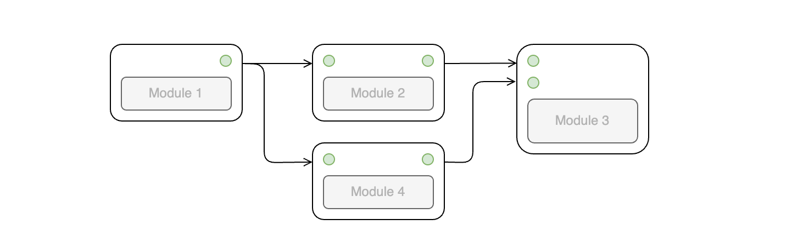

# 工作流

CityFlow平台的工作流组织方式为有向无环图（Directed Acyclic Graphs, DAGs），其中每个工作流由不同的模块组成，以一个模块的输出是下一个模块的输入的方式连接。这种结构能更清晰地展示推理过程，并能够创建复杂的工作流。

- [Init Settings](/workflow/init_settings)
- [Advanced Settings](/workflow/advanced_settings)
- [AI Assistant](/workflow/assistant)

